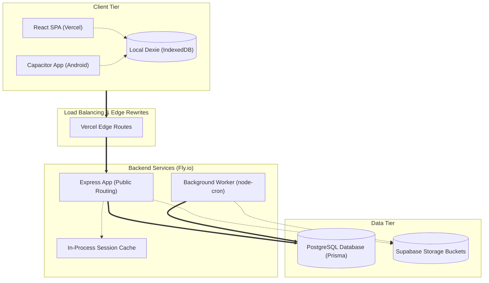

# Technical Requirement Document (TRD) — Kanaku

> Complete system requirements, architecture, API catalog, database schema logic, and external integration points.

---

## 1. System Architecture & Overview
Kanaku is built as a local-first, offline-capable personal finance application with a client-side database synchronized with a central Node.js API server.

- **Frontend:** React 18 + TypeScript on Vite, packaged with Capacitor (web + Android).
- **Local store:** Dexie (IndexedDB) for offline-first data; Dexie Cloud for sync.
- **Backend:** Node.js / Express (TypeScript) running as two Fly process groups from one image (`api` and `worker`).
- **ORM/DB:** Prisma + PostgreSQL.
- **Identity:** Supabase (auth); backend issues a **custom JWT** for API authorization.
- **Observability:** Pino JSON structured logs → Vector → Grafana Loki, and prom-client → Prometheus.

---

## 2. Tech Stack (June 2026 Reference)

### Frontend Stack
- **Framework:** React 18.3 (concurrent, Suspense)
- **Language:** TypeScript 5.x (`strict` mode)
- **Build Tool:** Vite 5/6 (per-route code-splitting)
- **Styling:** TailwindCSS 3 + shadcn/ui + Framer Motion (glassmorphic)
- **Routing:** React Router 6 (lazy routes)
- **State Management:** React Context + `useReducer` + Zustand (local stores)
- **Local DB:** Dexie 4 (IndexedDB) + `dexie-cloud-addon`, schema **v15**
- **Network:** `fetch` + custom `apiClient` (retry, dedupe, JWT refresh)
- **Realtime:** Socket.IO client (user-scoped) + Supabase Realtime fallback
- **Mobile Wrapper:** Capacitor 6/8 (Android first; iOS scaffold)
- **OCR:** Tesseract.js 5 (WASM) + Gemini 1.5 Flash fallback
- **Voice:** Web Speech API + Capacitor Speech + Gemini NLP

### Backend Stack
- **Runtime:** Node.js 22 LTS
- **Language:** TypeScript 6 (strict)
- **Framework:** Express 4 (modular feature routers)
- **ORM/DB:** Prisma 6.19.2 + PostgreSQL 16
- **Cache:** Redis 7 (Upstash prod) — OTP, JWT denylist, feature-gate cache, idempotency, rate-limit
- **Auth:** Supabase identity + custom JWT (HS256) — multi-strategy verify
- **Realtime:** Socket.IO 4 + Supabase Realtime
- **Validation:** Zod 3 middleware (`validateBody/Query/Params`)
- **Logging:** Winston (JSON) + Morgan
- **Security:** Helmet 7, CORS allow-list, express-rate-limit (Redis store), global body sanitiser
- **Workers:** Recurring posting, AA polling, notification fan-out
- **AI (OCR):** Tesseract (text) + Gemini 1.5 Flash (structuring) + `receipt_ai` FastAPI fallback
- **Email/SMS:** Resend (email) + MSG91/Twilio (OTP)
- **Account Aggregator:** Setu AA (RBI-licensed)

### Data Layer
- **PostgreSQL:** System of record (48 models).
- **Redis:** OTP TTL, refresh denylist, feature-gate cache, idempotency, rate limit.
- **Dexie (IndexedDB):** Local-first mirror, schema v15, per-row `syncStatus`.
- **Supabase Storage:** Cloud bucket for receipt images, KYC docs, and avatars.

---

## 3. API Specifications & Catalog
Source of truth: `backend/src/features/*/*.routes.ts` (36 modules). All routes are mounted under **`/api/v1/<module>`**.

### Conventions
- **Auth Header:** `Authorization: Bearer <accessToken>`
- **Idempotency:** Client-provided UUID sent in `Idempotency-Key` headers for mutating requests.
- **Response Shape:** `{ success: boolean, data?: any, error?: string, code?: string, requestId: string }`

### Endpoint Index
- **auth (`/api/v1/auth`):**
  - `POST /check-email`, `POST /register`, `POST /login/challenge` (Redis 60s), `POST /login` (JWT+refresh), `POST /refresh`, `POST /logout` (JWT blacklist), `GET|PUT /profile`, `POST /otp/send|verify`, `GET|DELETE /devices`, `DELETE /account`
- **pin (`/api/v1/pin`):**
  - `POST /create`, `POST /verify`, `POST /verify-security`, `POST /update`, `GET /status`, `GET|POST|DELETE /key-backup`
- **otp (`/api/v1/otp`):**
  - `POST /send`, `POST /verify`
- **sessions (`/api/v1/sessions`):**
  - `GET /:id`, `POST /:id/messages`, `GET /:id/messages`, `POST /:id/start`, `POST /:id/complete`, `POST /:id/cancel`
- **devices (`/api/v1/devices`):**
  - `POST /`, `GET /`, `GET /:deviceId`, `POST /:deviceId/sync`, `DELETE /:deviceId`
- **settings (`/api/v1/settings`):**
  - `GET /`, `PUT /`, `GET|POST|DELETE /backup`
- **avatars (`/api/v1/avatars`):**
  - `GET /`, `PUT /me`
- **accounts (`/api/v1/accounts`):**
  - `GET /`, `POST /`, `GET /:id`, `PUT /:id`, `DELETE /:id`
- **transactions (`/api/v1/transactions`):**
  - `GET /`, `POST /`, `POST /bulk`, `PATCH /:id`, `DELETE /:id` (recomputes account balances atomically)
- **recurring (`/api/v1/recurring`):**
  - `GET /`, `POST /`, `GET /:id`, `PUT /:id`, `DELETE /:id`, `PATCH /:id/toggle`
- **categorization (`/api/v1/categorization`):**
  - `POST /` (predict), `POST /learn` (feedback)
- **goals (`/api/v1/goals`):**
  - `GET /`, `POST /`, `GET /:id`, `PUT /:id`, `DELETE /:id`, `GET|POST /:id/members`, `DELETE /:id/members/:memberId`
- **budgets (`/api/v1/budgets`):**
  - `GET /`, `POST /`, `GET /:id`, `PUT /:id`, `DELETE /:id`, `POST /:id/recalculate`
- **loans (`/api/v1/loans`):**
  - `GET /`, `POST /`, `GET /:id`, `PUT /:id`, `DELETE /:id`, `POST /:id/payments`
- **investments (`/api/v1/investments`):**
  - `GET /`, `GET /:id`, `POST /`, `PUT /:id`, `DELETE /:id`
- **stocks (`/api/v1/stocks`):**
  - `GET /markets`, `GET /search`, `GET /stock`, `GET /batch`, `GET /meta`
- **gold (`/api/v1/gold`):**
  - `GET /`, `POST /`, `GET /:id`, `PUT /:id`, `DELETE /:id`
- **bills (`/api/v1/bills`):**
  - `GET /`, `GET /:id`, `POST /`, `DELETE /:id`
- **dashboard (`/api/v1/dashboard`):**
  - `GET /summary`, `GET /cashflow`
- **friends (`/api/v1/friends`):**
  - `GET /`, `POST /`, `POST /bulk`, `POST /import`, `GET /:id`, `PUT /:id`, `DELETE /:id`
- **groups (`/api/v1/groups`):**
  - `GET /`, `POST /repair-all-members`, `POST /`, `GET /:id`, `PUT /:id`, `POST /:id/repair-members`, `DELETE /:id`
- **todos (`/api/v1/todos`):**
  - Lists: `GET|POST /lists`, `PUT|DELETE /lists/:id`
  - Items: `GET|POST /items`, `PUT|DELETE /items/:id`, `GET /lists/:listId/items`
  - Shares: `GET|POST /shares`, `PUT|DELETE /shares/:id`
- **collaboration (`/api/v1/collaboration`):**
  - `GET /`, `GET /pending`, `GET /:id`, `DELETE /:id`
- **advisors (`/api/v1/advisors`):**
  - `GET /`, `GET /application/my`, `POST /apply`, `PUT /online-status`, `PUT /role-mode`, `POST /availability`, `PUT /availability/status`, `GET /admin/applications` (admin/manager), `PUT /admin/:id/approve|reject` (admin/manager)
- **bookings (`/api/v1/bookings`):**
  - `GET /`, `GET /:id`, `PUT|POST /status`
- **payments (`/api/v1/payments`):**
  - `POST /webhook` (PUBLIC), `POST /initiate`, `POST /complete`, `POST /fail`, `POST /refund`
- **notifications (`/api/v1/notifications`):**
  - `GET /`, `GET /unread/count`, `PUT /:id/read`, `POST /mark-all-read`, `DELETE /:id`, `POST /send` (admin)
- **sync (`/api/v1/sync`):**
  - `POST /pull`, `POST /push`, `POST /register-device`, `POST /deactivate-device`
- **import (`/api/v1/import`):**
  - `POST /upload`, `POST /confirm`, `GET /:sessionId`
- **receipts (`/api/v1/receipts`):**
  - `POST /parse`
- **voice (`/api/v1/voice`):**
  - `POST /process-audio`, `POST /process`, `POST /learn`
- **ai (`/api/v1/ai`):**
  - `POST /events`, `GET /quota`, `GET /insights`, `GET /health-score`, `GET /recommendations`, `GET /fraud-alerts`, `GET /bill-predictions`, `GET /spending-patterns`
- **aa (`/api/v1/aa`):**
  - `POST /notification` (PUBLIC), `POST /consent`, `GET /consent/status/:consentHandle`, `POST /data/session`, `GET /data/fetch/:sessionId`, `GET /financial-summary`
- **admin (`/api/v1/admin`):**
  - `GET /features`, `GET /ai-features`, `GET /users`, `GET /stats`, `GET /cache/metrics`, `POST /features/toggle`, `POST /ai-features/toggle`, `GET /reports/users|revenue`
- **webhooks (`/api/v1/webhooks`):**
  - `POST /sendgrid` (PUBLIC)

---

## 4. Request / Response Validation Schemas (Zod)
Zod enforces shape rules before controllers execute.

- **RegisterInput (`POST /register`):**
  - `{ email: string, name: string, password: string /* 8+ chars */, role?: 'user'|'advisor', phone?: string, mobile?: string }`
- **LoginInput (`POST /login`):**
  - `{ email: string, password: string, challengeCode?: string }`
- **AccountCreate (`POST /accounts`):**
  - `{ name: string(1..120), type: string(1..60), provider?: string, country?: string, balance?: number(>=0), currency: string(len 3), clientRequestId?: string }`
- **TransactionCreate (`POST /transactions`):**
  - `{ accountId: string, type: 'income'|'expense'|'transfer'|'withdrawal', amount: number(>0), category: string, date: Date, transferToAccountId?: string, expenseMode?: 'individual'|'group'|'loan', groupExpenseId?: string, loanType?: 'borrowed'|'lent', emiAmount?: number, notes?: string }`
- **RecurringCreate (`POST /recurring`):**
  - `{ title: string, amount: number(>0), category: string, interval: 'weekly'|'monthly'|'yearly', nextDueDate: Date, accountId?: string, autoProcess?: boolean }`

---

## 5. Third-Party Integrations

### Supabase
- **Role:** Handles database storage buckets (Receipt files, KYC certificates, profile avatars).
- **Security:** Signed URLs generated server-side. No service-role keys allowed on frontend client.

### Setu Account Aggregator
- **Role:** Bridges connection to user-authorized Indian bank accounts (RBI framework).
- **Validation:** Recent in-app verification OTP is validated backend-side before Setu consent setup begins. Webhook calls verify HMAC-SHA256 headers.

### Brevo / Resend (Email Engine)
- **Role:** Sends emails (onboarding verification, budget warnings, advisor session invites).
- **Delivery:** Queued in PostgreSQL database outbox table, drained asynchronously by `node-cron` daemon.

### Gemini 1.5 Flash (AI Model)
- **Role:** Structured JSON parser for Receipt OCR drafts and ambiguous natural language voice logging.
- **Failover:** Local OCR parser runs locally first. Circuit breaker prevents API throttling; FastAPI backend handles fallback.

---

## 6. Architecture Diagram (Mermaid component overview)

