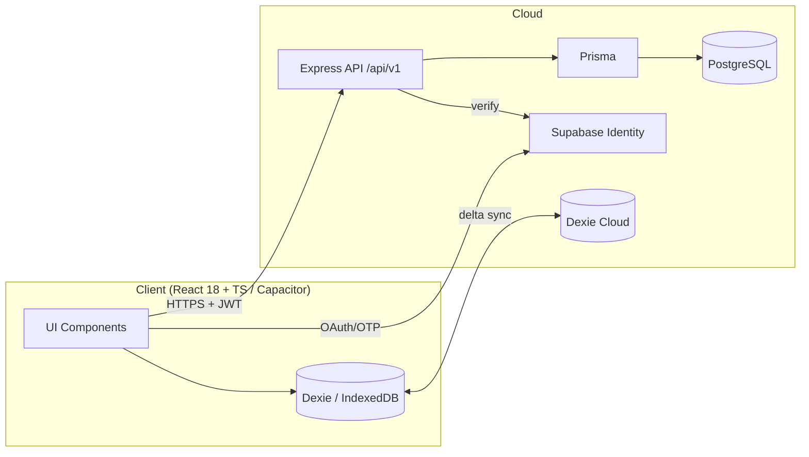
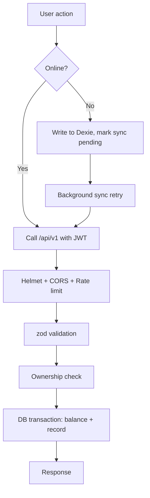

# Architecture Diagram — Kanaku

> Diagrams use [Mermaid](https://mermaid.js.org/) so they render in GitHub/VS Code and stay in version control.

## High-Level System

## Request/Auth Path

## Tooling for richer diagrams
- **Mermaid** (preferred, code-based, diffable).
- **draw.io** / **Figma** for visual design assets (export to `03_UI_UX_Design/UI_Designs`).

