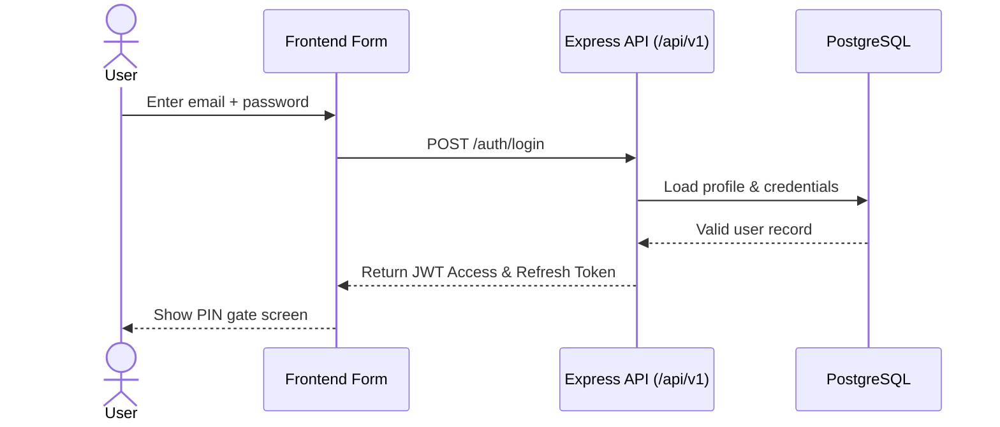
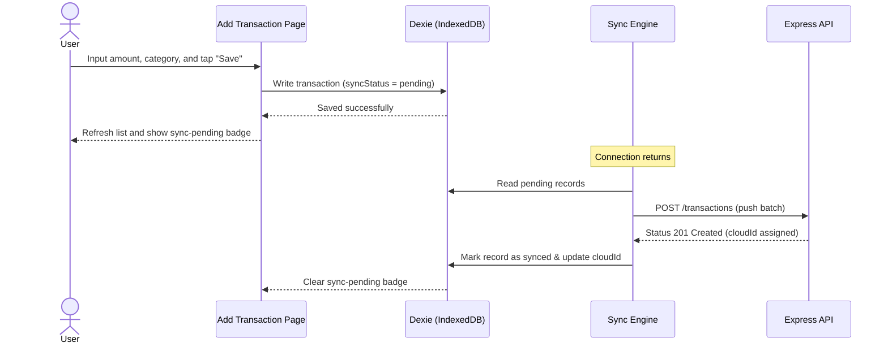

# UI/UX Design & Screen Map — Kanaku

> Maps every user interface surface, frontend component, local database interaction, and visual flow.

---

## 1. Screen → Component → Service → API Map
Use this map to trace any frontend feature from the UI layout down to the Dexie database and Express `/api/v1` routes.

### Marketing & Public Surfaces (`components/marketing`, `pages/`)
| Screen | Component | API |
|---|---|---|
| Landing Page | `marketing/LandingPage` | — |
| About Page | `marketing/AboutPage` | — |
| Pricing Page | `marketing/PricingPage` | — |
| Contact Page | `marketing/ContactPage` | — |
| Privacy & Terms | `marketing/PrivacyPolicy`, `marketing/Terms` | — |
| Public Navbar | `ui/PublicNavbar` | — |

### Auth & Onboarding (`components/auth`, `components/auth/onboarding`)
| Screen | Component | Service / Helper | API Endpoint |
|---|---|---|---|
| Auth Shell | `auth/AuthFlow`, `auth/AuthPage` | `services/permissionService` | `/auth/*` |
| Sign In / Sign Up | `auth/SignInForm`, `auth/SignUpForm` | `services/auth` | `/auth/login`, `/auth/register` |
| OTP Screen | `auth/OTPVerification` | `services/pinService` | `/otp/send`, `/otp/verify` |
| PIN Screen | `auth/PINSetup`, `auth/PINAuth` | `services/pinService` | `/pin/create`, `/pin/verify` |
| Onboarding Slides | `NewUserOnboarding`, `BankAccountStep` | Onboarding stepper states | `/settings/profile` |

### Core Shell & Navigation (`components/core`, `components/ui`, `components/shared`)
| Component | Purpose / Context |
|---|---|
| `shared/AppLayout`, `shared/CenteredLayout` | App shell wrapping layout containers. |
| `core/Header`, `core/Sidebar`, `core/BottomNav` | Navigation bars responding to screen sizes. |
| `shared/QuickActionModal` | Quick access to transaction logs, voice, and scanner. |
| `ui/SyncStatusBar` | Visual indicator showing connection state and sync status. |
| `shared/FeatureGate` | RBAC gates that show/hide elements depending on user permissions. |

### Financial Core
| Screen | Component | Dexie Tables | Service | API |
|---|---|---|---|---|
| Dashboard | `core/Dashboard`, `ui/StatCard` | `accounts`, `transactions` | Aggregation helpers | `/dashboard/summary` |
| Accounts | `core/Accounts`, `core/AddAccount` | `accounts` | `lib/backend-api` | `/accounts/*` |
| Transactions | `core/Transactions`, `transactions/AddTransaction` | `transactions`, `accounts` | `hooks/useTransactionCreation` | `/transactions/*` |
| Receipts Scanner | `transactions/ReceiptScanner`, `transactions/BillUpload` | `documents`, `expenseBills` | `services/receiptScannerService` | `/receipts/parse` |
| Import Statement | `transactions/StatementImport` | `importHistories` | `services/statementImportService` | `/import/upload` |

### Wealth
| Screen | Component | Dexie Tables | Service | API |
|---|---|---|---|---|
| Goals | `goals/Goals`, `goals/AddGoal` | `goals`, `goalContributions` | `lib/goal-utils` | `/goals/*` |
| Loans | `loans/Loans`, `loans/AddLoan` | `loans`, `loanPayments` | EMI payment helper | `/loans/*` |
| Investments | `investments/Investments`, `AddGold` | `investments`, `gold` | `lib/metalPriceService` | `/investments/*`, `/gold/*` |
| Budgets | `features/BudgetAlertsPage` | `budgets`, `budgetAlerts` | `services/budgetCoachService` | `/budgets/*` |
| Recurring | `features/RecurringTransactions` | `recurringTransactions` | Next due date worker | `/recurring/*` |

### Social, Collaboration & Advisor
| Screen | Component | Dexie Tables | Service / API |
|---|---|---|---|
| Friends List | `groups/FriendsList`, `groups/FriendProfile` | `friends` | `/friends/*` |
| Groups (Split) | `groups/Groups`, `groups/AddGroup` | `groups`, `groupExpenses` | `/groups/*` (Split settlement) |
| To-Do Lists | `features/ToDoLists`, `features/ToDoListDetail` | `toDoLists`, `toDoItems` | `/todos/*` |
| Book Advisor | `advisor/BookAdvisor` | `bookingRequests` | `/advisors`, `/bookings` |
| Advisor workspace | `advisor/AdvisorWorkspace` | `advisorSessions` | `/advisors/*`, `/sessions/*` |

---

## 2. UI Flow & Wireframe Specification
Every major screen follows consistent layout states: loading, idle, submitting, error, and offline-mode.

### Login Screen Flow
1. **Input:** Email + Password.
2. **Action:** Click "Sign In".
3. **Guard:** Check client-side validation (valid email format, empty checks).
4. **Offline support:** If offline, check for cached local session variables before failing.
5. **Success:** Store token securely in `TokenManager`, trigger PIN setup if new user, otherwise redirect to PIN verification.

### Dashboard Layout
- **Upper Section:** Total net worth summary, showing aggregated cash, bank, and investments.
- **Center Section:** Spend-by-category chart (wheel diagram) showing monthly limits.
- **Lower Section:** Scrollable list of recent transactions with clear sync badges showing if they are pending sync.
- **Bottom Navigation:** Bottom bar on mobile screen, converting to sidebar on wide desktop screens.

### Add Transaction Screen Flow
- Displays floating fields: Amount input, Type toggle (income vs. expense), Category selector, Account drawer, and Date picker.
- **Offline Mode:** Tapping "Save" writes immediately to Dexie, displays a toast alert: *"Saved locally, will sync when online"*, and returns to the dashboard showing a pending-sync badge on the list.

### Receipt Scanner Flow
- Open Camera → Capture Picture → Send crop data to Tesseract.js (local OCR) → If low confidence, route to Gemini API fallback.
- Shows prefilled form containing extracted Merchant, Date, and Amount. Correct fields display in green; low-confidence parsed fields highlight in orange, requiring the user to confirm/adjust before saving.

---

## 3. UI Interaction Sequence Diagrams
These diagrams illustrate client-side actions and database caching.

### User Login Flow (UI Perspective)

### Adding a Transaction (Offline-First UI Flow)

