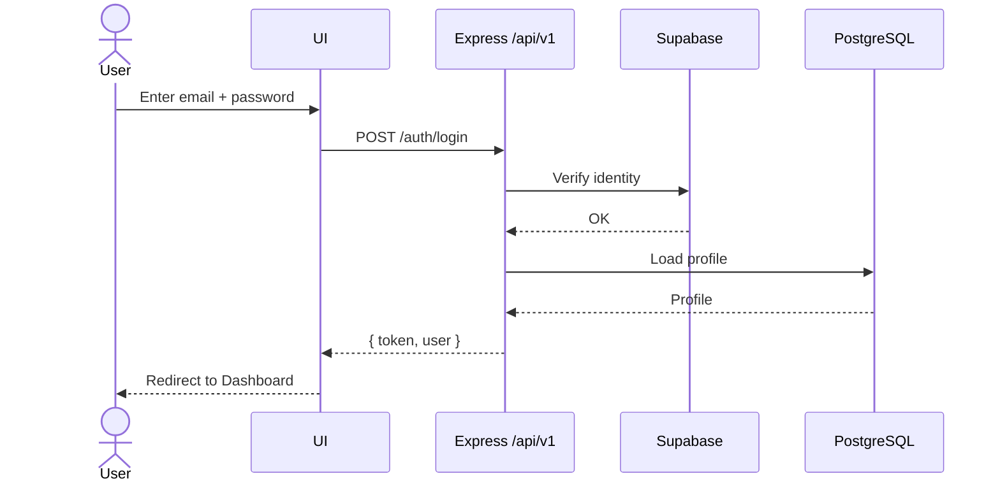
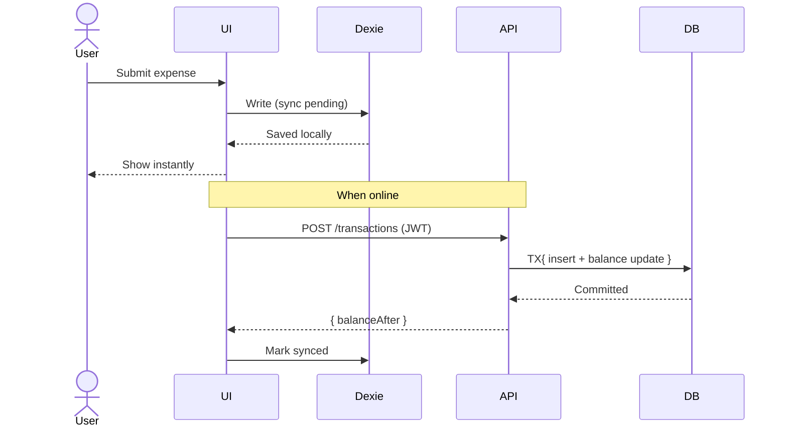

# Sequence Diagrams — UI/UX

## Login Flow (text)
User → UI → Backend → DB
1. User enters credentials.
2. UI sends request to backend (`POST /api/v1/auth/login`).
3. Backend validates with Supabase / DB.
4. Backend returns JWT.
5. UI stores session and redirects to Dashboard.

## Login Flow (Mermaid)

## Add Expense (offline-first, Mermaid)

