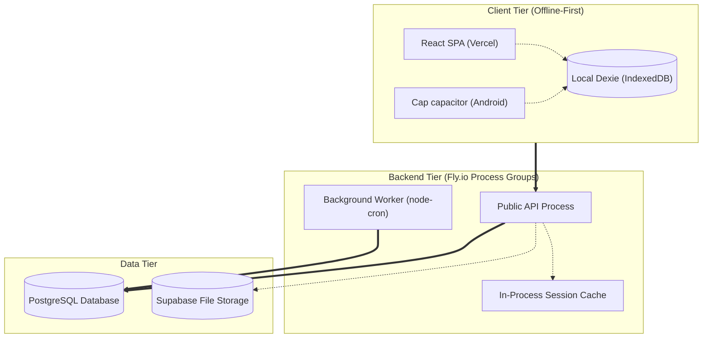
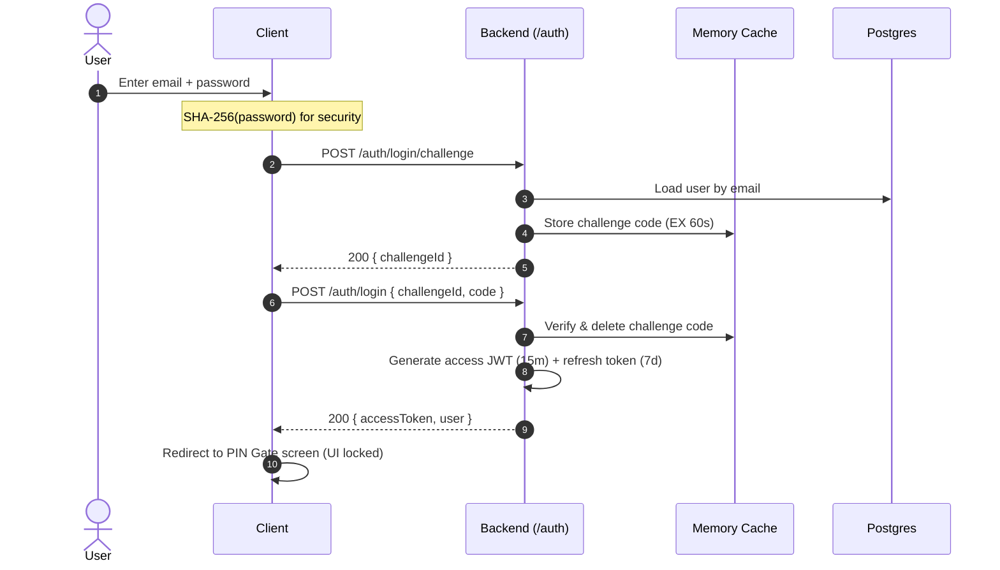
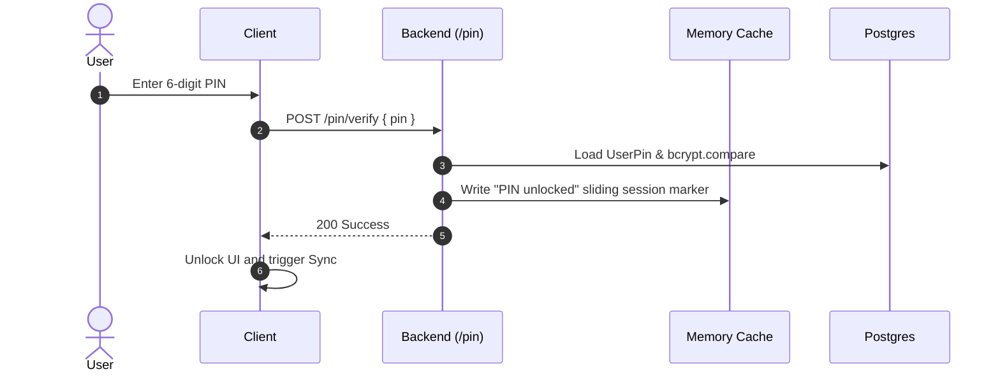
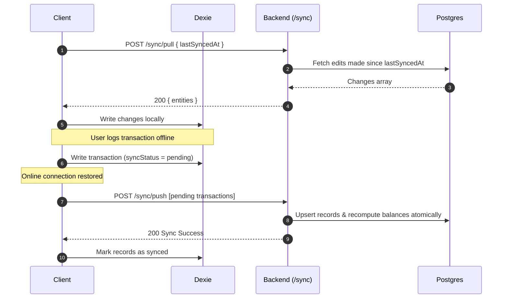
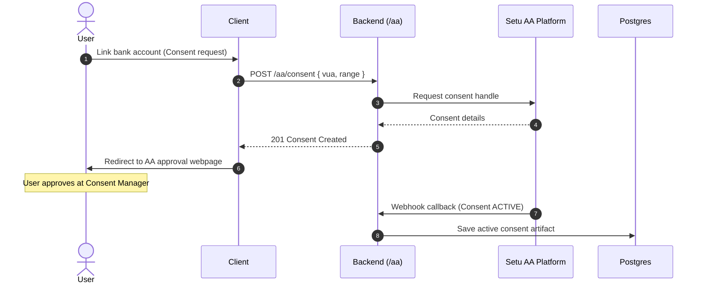

# System Architecture & App Flows — Kanaku

> Detailed specification of the system architecture, component diagrams, access control, request lifecycles, and core sequence diagrams.

---

## 1. System Architecture Overview
Kanaku is designed as a local-first, offline-first personal finance tracker. 
- The client-side application (React + Capacitor) writes immediately to an encrypted IndexedDB (Dexie) and renders updates optimistically.
- A background sync engine synchronizes local database state with the PostgreSQL server via the BFF (Backend-For-Frontend) Express API.
- All session caches, API rate-limiting, and feature gates run in-process to keep deployments lightweight.
- Background automation tasks (like recurring transaction posting and notification queues) run on a secondary non-public backend worker daemon using PostgreSQL tables as an outbox.

### Component Diagram

---

## 2. Roles & Permissions Governance
Users belong to one of four distinct roles, enforced server-side via middleware checks on every API request.

### Permission Matrix
| Module / Capability | End User | Client | Advisor | Admin |
|---|:---:|:---:|:---:|:---:|
| Create Accounts & Transactions | ✅ | ✅ | ❌ | ❌ |
| Scan Receipts / Voice NLP | ✅ | ✅ | ❌ | ❌ |
| Split Bills / Manage Friends | ✅ | ✅ | ❌ | ❌ |
| Book Financial Advisors | ❌ | ✅ | ❌ | ❌ |
| Manage Schedule / Consult Clients | ❌ | ❌ | ✅ | ❌ |
| View Client Shared Reports | ❌ | ❌ | ✅ | ❌ |
| Platform Overrides & Feature Flags | ❌ | ❌ | ❌ | ✅ |
| Approve / Deny Advisor Applications | ❌ | ❌ | ❌ | ✅ |
| System Monitor & Diagnostics | ❌ | ❌ | ❌ | ✅ |

### Roles Definitions & Workflows
- **End User:** Standalone personal tracker. Logs transactions, creates local budgets, scans receipts.
- **Client:** Standalone features + collaboration. Can browse verified advisors, book consultative slots, and grant view-only access to portfolio reports.
- **Advisor:** Financial professional. Sets slots availability, accepts client session requests, reviews client reports, and chats inside active sessions. Cannot create transactions or change bank balances.
- **Admin:** Site manager. Verifies and approves advisor certifications, overrides feature flags, monitors sync queues, and suspends accounts. Cannot read client private transactions.

---

## 3. Universal Request Lifecycle
Every database mutation follows this strict pipeline:
1. **User Action:** The user taps save.
2. **Local Write:** Save immediately to Dexie database (`syncStatus='pending'`). Update UI optimistically.
3. **HTTP Dispatch:** Sync engine sends a request to the backend with a unique `Idempotency-Key` and `Bearer JWT`.
4. **Security Filter:** Middleware inspects request: JWT verify → Session timeout evaluation → PIN unlock verification.
5. **Validation:** Zod validates request payload. Ownership check verifies the user owns the target account.
6. **Execution:** Controller updates DB inside an atomic `prisma.$transaction` and invalidates caches.
7. **Response:** Server returns `200 OK` with a custom `requestId`.
8. **Client Sync:** Client marks record as `synced` and saves the generated `cloudId`.

---

## 4. Technical Sequence Diagrams (Core Workflows)

### 4.1 Login Challenge (BFF / Two-Step Challenge)
The client authenticates against the backend, which verifies the password and issues a custom JWT.

### 4.2 PIN Unlock Verification
Blocks access to financial modules until a PIN is verified server-side.

### 4.3 Offline-First Sync
Pulls updates from PostgreSQL and pushes local changes back to the database.

### 4.4 Account Aggregator Consent (Setu AA)

---

## 5. Non-Technical Explanations (Simple Guides)

### 5.1 Technology Stack (The Restaurant Analogy)
- **The Guest (Frontend App):** The screen on your phone or web browser. This is where you look at the menu, tap buttons, and place your order.
- **The Waiter (Backend API Server):** The messenger. The waiter takes your request (like "Show me my budget"), makes sure you are allowed to ask, and runs it to the kitchen.
- **The Kitchen (Database & Cache):**
  - **The Fridge (Session Cache):** Holds quick items (like water bottles) that are needed instantly, such as whether your session is active.
  - **The Pantry (Postgres Database):** Holds the permanent ingredients—your saved transactions, accounts, and budgets.
- **The Delivery Rider (Background Worker):** Operates independently in the background. It processes recurring subscriptions or budget alerts without interrupting guests.
- **The Ingredient Supplier (External Services):** Third-party companies that send emails (Brevo) or connect to your bank (Plaid / Account Aggregator).

### 5.2 Security Access Gates (The Office Analogy)
Think of Kanaku's roles like keycards in a **Secure Office Building**:
- When you log in, you are handed a **digital keycard** showing your role: *User*, *Client*, *Advisor*, or *Admin*.
- Every time you try to go into a room or tap a button, a **Security Guard (Middleware)** stops you and checks your keycard:
  - **Regular Offices:** Anyone with any card can go in (e.g., viewing your own transactions).
  - **Consulting Rooms:** Only cards marked *Client* or *Advisor* are allowed.
  - **Control Room (Admin Console):** Only cards marked *Admin* can pass. Standard users are turned away at the door.

### 5.3 Collaboration Workflow (The Financial Consultation Analogy)
This workflow shows the lifecycle of how people interact on the platform:
1. **Advisor Gets Approved:** A professional applies to join. The platform **Admin** reviews their qualifications and unlocks their profile.
2. **Client Books a Session:** A **Client** schedules time with the newly approved advisor.
3. **Collaboration Happens:** The **Client** securely shares view-only financial reports. The **Advisor** reviews it in real-time and advises them to adjust their budget.
4. **Platform Audits:** The **Admin** monitors platform security logs to ensure compliance, keeping everyone's data safe.
