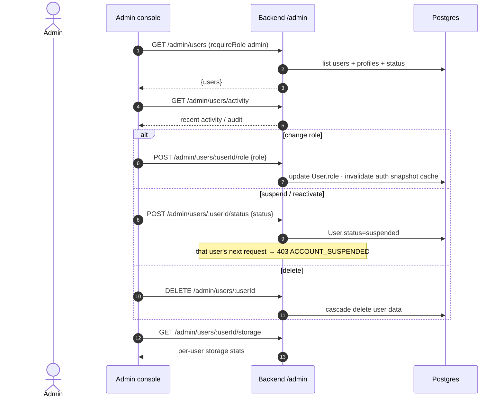
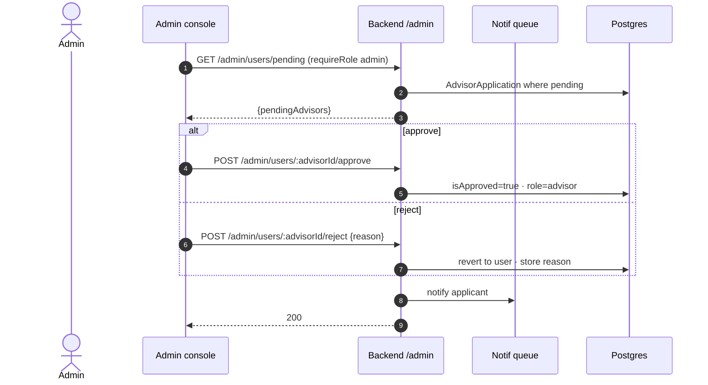
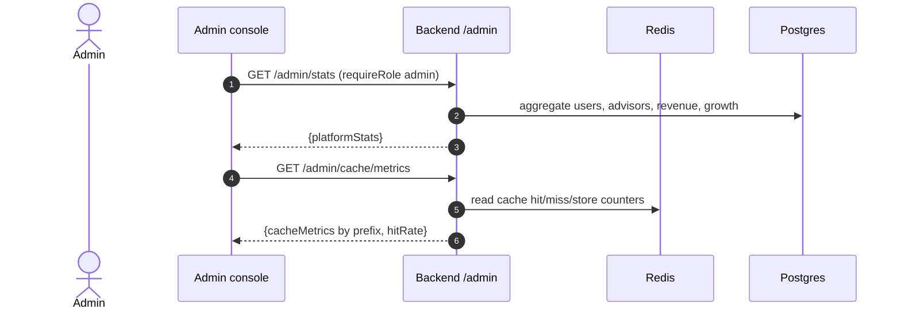
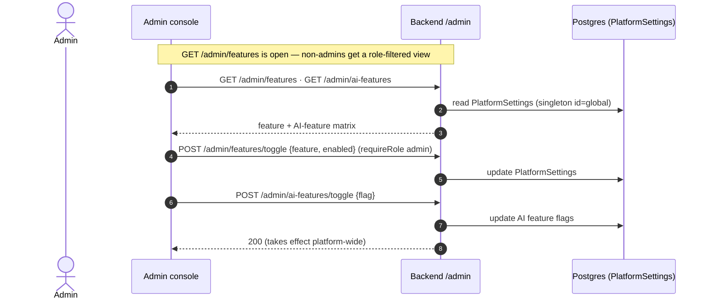
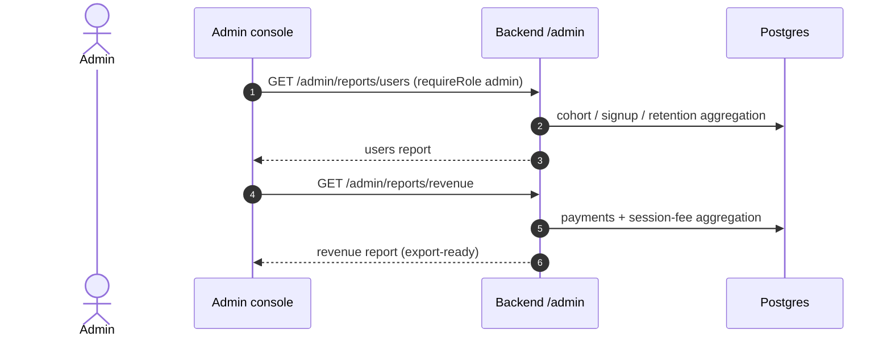
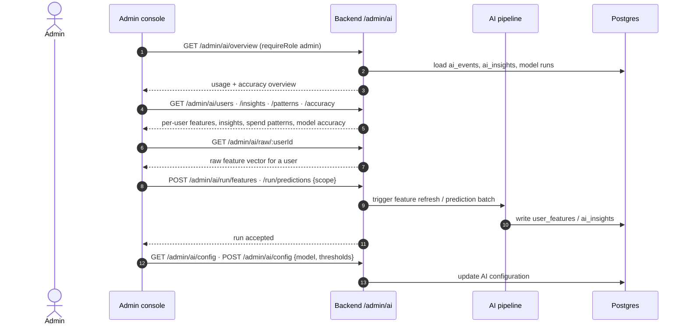

# Admin‑Role Feature Flows

All `/admin/*` routes require `requireRole('admin')` (the two feature‑flag *read*
endpoints are open to any authenticated user but return a role‑filtered view).
Admins also have advisor‑vetting (shared with managers) and all user features.

---

## 1. User management

## 2. Advisor approval (admin path)

## 3. Platform statistics & cache metrics

## 4. Feature flags

## 5. Reports

## 6. AI intelligence console

