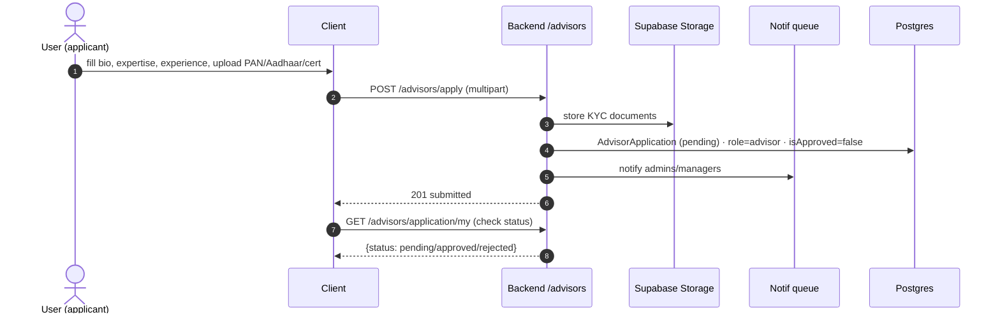
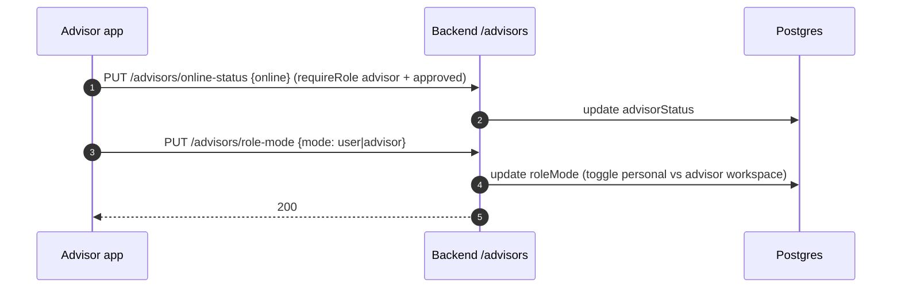
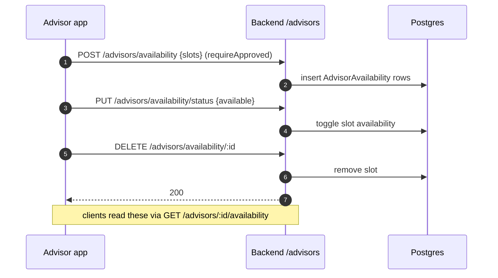
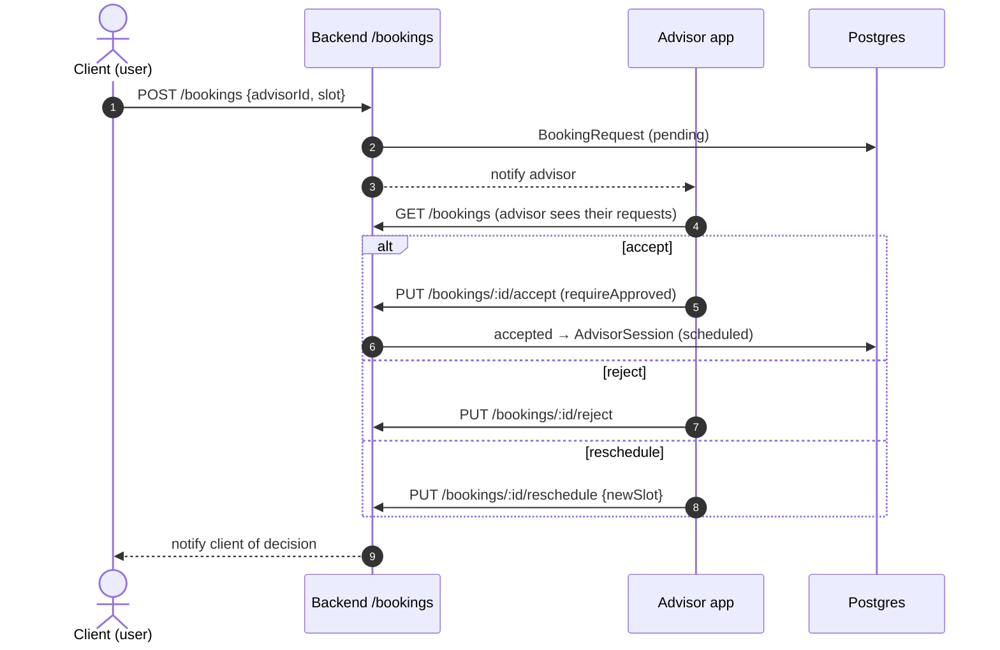
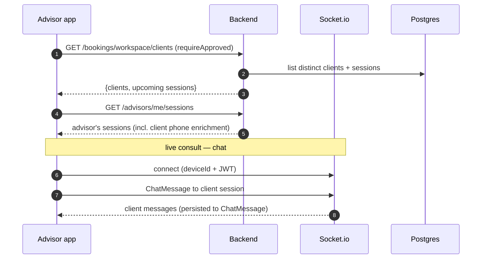
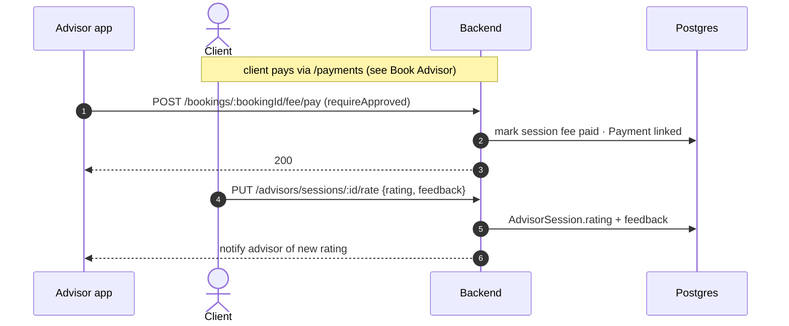

# Advisor‑Role Feature Flows

An advisor is a `user` who applied and was **approved** (`isApproved=true`).
Advisor‑only routes are guarded by `requireRole('advisor')` + `requireApproved`.
Advisors also keep all personal‑finance features (see USER_FLOWS.md); below are the
advisor‑specific ones.

---

## 1. Become an advisor (application)

## 2. Online status & role mode

## 3. Manage availability

## 4. Incoming bookings

## 5. Advisor workspace & sessions

## 6. Session fee & rating

