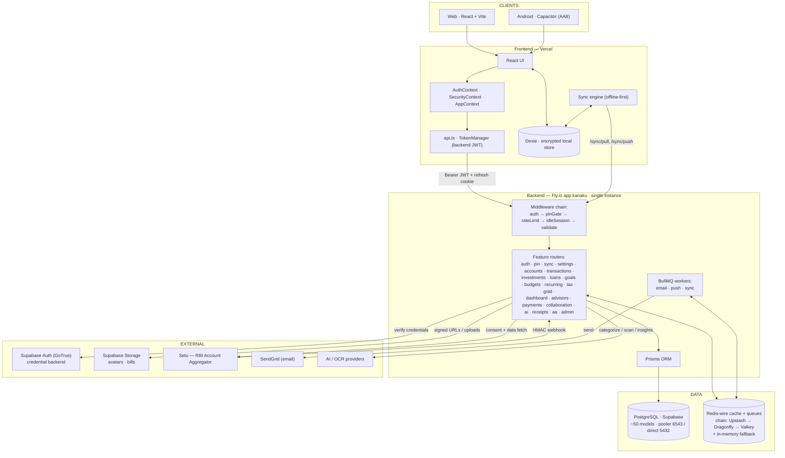

# Finora / Kanaku — System Architecture

A local‑first personal‑finance app. The client keeps an encrypted working set on
device (Dexie, PIN‑protected) and syncs through a backend‑for‑frontend (BFF) API.
The backend owns identity (issues its own JWT), enforces the PIN server‑side, and
talks to Postgres, Redis, and a few external providers.

> Companion: [SEQUENCE_DIAGRAMS.md](./SEQUENCE_DIAGRAMS.md) — communication flows
> for Login, PIN, Sync, and Account Aggregator.

## Component diagram

## Notes

- **Identity is backend‑managed (BFF).** The client only ever holds the backend's
  **HS256 JWT** (15‑min access + 7‑day refresh as an HttpOnly cookie). Supabase Auth
  is used *server‑side* as the credential backend; the client never receives a
  Supabase token for API auth.
- **The PIN is a real server‑side control** (when `PIN_GATE_ENABLED=true`): financial
  routes and private profile fields require a live, server‑recorded PIN unlock — not
  just a client lock. See the PIN sequence.
- **Local‑first:** the encrypted Dexie store is the working set; the backend is the
  sync source of truth. Nothing financial is fetched before PIN unlock.
- **Resilience:** the cache layer fails over down a priority chain of Redis‑wire
  stores and ultimately to in‑memory, so a provider quota can't take login down.
  *(BullMQ queues use `REDIS_URL` only.)*
- **Single backend instance** — the in‑memory fallbacks assume one Fly machine.

> ⚠️ Verify Supabase **Row‑Level Security** is enabled on the data tables — the
> publishable key + project URL are public by design, so RLS is the real guard.
