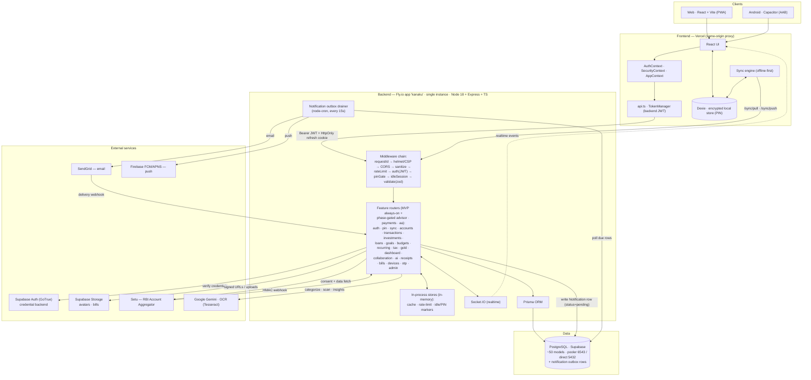
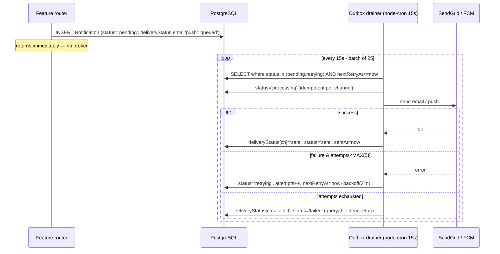

# Finora / Kanaku — System Architecture

A local‑first personal‑finance app. The client keeps an encrypted working set on
device (Dexie, PIN‑protected) and syncs through a backend‑for‑frontend (BFF) API.
The backend owns identity (issues its own JWT), enforces the PIN server‑side, and
talks to Postgres and a few external providers. **There is no Redis / queue
broker:** cache, rate‑limiting and session markers run in‑process, and async
notification delivery runs off a PostgreSQL outbox drained by `node-cron`.

> Companion: [SEQUENCE_DIAGRAMS.md](./SEQUENCE_DIAGRAMS.md) — communication flows
> for Login, PIN, Sync, and Account Aggregator.

## Component diagram

## Request lifecycle

1. The client attaches the backend's short‑lived **access JWT** (`Authorization:
   Bearer …`) and, on web, the **HttpOnly refresh cookie** (same‑origin via the
   Vercel proxy; native clients send `x-client-platform: native`).
2. The **middleware chain** stamps a request id, sets security headers (Helmet +
   per‑request CSP nonce), applies CORS + body sanitization, throttles
   (in‑memory rate‑limit), authenticates the JWT, enforces the **PIN gate** and
   **idle‑session** window, then validates the body with **Zod**.
3. The matching **feature router** runs business logic through **Prisma** against
   **PostgreSQL**, using the in‑process cache where helpful.
4. Side effects fan out: realtime events over **Socket.IO**, a **Notification**
   row written at `status='pending'` for async email/push, signed Storage URLs,
   AA consent calls, AI/OCR calls.
5. The **outbox drainer** (separate `node-cron` loop) delivers the pending
   notifications independently of the request.

## Notification delivery — Postgres outbox (replaces BullMQ/Redis)

Tunable via env (all optional): `NOTIFICATION_OUTBOX_CRON` (default `*/15 * * * * *`),
`NOTIFICATION_OUTBOX_BATCH` (25), `NOTIFICATION_MAX_ATTEMPTS` (5),
`CACHE_MAX_ENTRIES` (50000). Source: [`workers/index.ts`](../../backend/src/workers/index.ts).

## Tech stack

| Layer | Technology |
|---|---|
| **Web client** | React + Vite (PWA), TypeScript, Dexie (encrypted IndexedDB), offline‑first sync engine |
| **Mobile** | Capacitor → Android AAB (same React UI) |
| **Frontend host** | Vercel — same‑origin reverse proxy to the backend (enables the cross‑site HttpOnly refresh cookie) |
| **Backend runtime** | Node.js ≥18, Express 4, TypeScript 5 |
| **API security** | JWT HS256 (`jsonwebtoken` / `jose`), Helmet + per‑request CSP nonce, CORS allowlist, Zod validation, body sanitization, in‑memory rate‑limiting, server‑side PIN gate + idle‑session, `Idempotency-Key` support |
| **ORM / database** | Prisma 6 → **PostgreSQL (Supabase)**, pooler `:6543` (app) / direct `:5432` (migrations), ~50 models |
| **In‑process stores** | bounded TTL cache, rate‑limit buckets, idle/PIN session markers — **no Redis** (single Fly instance) |
| **Realtime** | Socket.IO 4 |
| **Background jobs** | `node-cron` — notification **outbox drainer**, nightly cleanup + GDPR hard‑delete sweep, AI background jobs |
| **Email / push** | SendGrid (`@sendgrid/mail`); Firebase Admin / FCM + APNS — delivered via the Postgres outbox |
| **Identity / storage** | Supabase Auth (GoTrue) as the server‑side credential backend; Supabase Storage (avatars, bills, signed URLs) |
| **AI / OCR** | Google Gemini (`@google/generative-ai`), Tesseract.js + `sharp`, `pdf-parse`; protected by circuit breakers |
| **Open Banking** | Setu — RBI Account Aggregator (consent + HMAC webhooks; AES‑256‑GCM at rest) |
| **Logging** | Winston |
| **Backend host** | Fly.io (app `kanaku`, single machine, region `sin`), Docker image |
| **CI/CD** | GitHub Actions → `flyctl deploy` (backend); Vercel auto‑deploy (frontend) |

## API surface

All routes are under `/api/v1`. Public liveness at `GET /health`; authenticated
diagnostics at `GET /api/v1/health/deep` (DB + circuit breakers + crypto — no
Redis/queue health, those were removed). Admin metrics at
`GET /api/v1/health/metrics`.

- **Always mounted (MVP):** `auth`, `avatars`, `webhooks`, `sync`, `pin`,
  `transactions`, `accounts`, `goals`, `loans`, `settings`, `friends`,
  `investments`, `todos`, `groups`, `categorize`, `learn`, `voice`, `import`,
  `ai`, `receipts`, `notifications`, `devices`, `bills`, `dashboard`, `admin`,
  `stocks`, `otp`, `recurring`, `budgets`, `tax`, `gold`, `collaborations`.
- **Phase‑gated (deferred → 404 unless opted in via `ENABLED_MODULES`):**
  `advisor` → `bookings`/`advisors`/`sessions`; `payments` → `payments`;
  `aa` → `aa`. Keeps regulated/unfinished endpoints unreachable in production
  even though the code ships in the repo. Source:
  [`routes/index.ts`](../../backend/src/routes/index.ts).

## Notes

- **Identity is backend‑managed (BFF).** The client only ever holds the backend's
  **HS256 JWT** (15‑min access + 7‑day refresh as an HttpOnly cookie). Supabase Auth
  is used *server‑side* as the credential backend; the client never receives a
  Supabase token for API auth.
- **The PIN is a real server‑side control** (when `PIN_GATE_ENABLED=true`): financial
  routes and private profile fields require a live, server‑recorded PIN unlock — not
  just a client lock. See the PIN sequence.
- **Local‑first:** the encrypted Dexie store is the working set; the backend is the
  sync source of truth. Nothing financial is fetched before PIN unlock.
- **No Redis / queue broker.** Cache, rate‑limiting and the idle/PIN session markers
  all run **in‑process**, so a provider quota can't take login down. Async email/push
  is a **PostgreSQL outbox**: producers write a `Notification` row at
  `status='pending'`; the `node-cron` drainer ([`workers/index.ts`](../../backend/src/workers/index.ts))
  polls due rows, sends via SendGrid/FCM, and drives
  `pending → processing → sent | retrying | failed` with exponential backoff. A row
  that exhausts its retries rests at `status='failed'` — the queryable dead‑letter
  equivalent (the `Notification @@index([status, nextRetryAt])` powers the sweep).
- **Single backend instance** — the in‑memory stores assume one Fly machine. Scaling
  horizontally would require re‑homing cache / rate‑limit / session markers to a
  shared store.
- **Module phasing** — deferred regulated modules stay unmounted unless
  `ENABLED_MODULES` opts them in; MVP modules are always mounted.

> ⚠️ Verify Supabase **Row‑Level Security** is enabled on the data tables — the
> publishable key + project URL are public by design, so RLS is the real guard.
