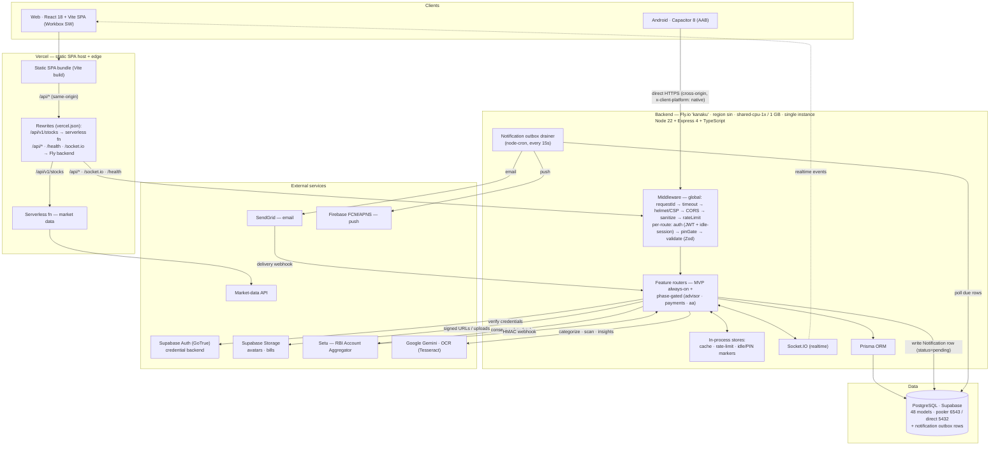
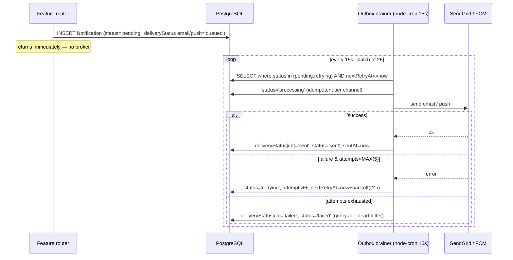

# Finora / Kanaku — System Architecture

A local‑first personal‑finance app. The client keeps an encrypted working set on
device (Dexie, PIN‑protected) and syncs through a backend‑for‑frontend (BFF) API.
The backend owns identity (issues its own JWT), enforces the PIN server‑side, and
talks to Postgres and a few external providers. **There is no Redis or queue
broker:** cache, rate‑limiting and session state run in‑process, and async
notification delivery runs off a PostgreSQL outbox drained by `node-cron`.

> Companion: [SEQUENCE_DIAGRAMS.md](./SEQUENCE_DIAGRAMS.md) — communication flows
> for Login, PIN, Sync, and Account Aggregator.

## Component diagram

## Request lifecycle

1. **Edge routing.** The web SPA is served from Vercel; its API calls are
   same‑origin and routed by `vercel.json`: `/api/v1/stocks` is answered by a
   Vercel **serverless function** (market data), while `/api/*`, `/health` and
   `/socket.io` are reverse‑proxied to the Fly backend. The **Capacitor** app
   calls the Fly backend **directly** (cross‑origin, `x-client-platform: native`).
2. **Auth transport.** The client sends the backend's short‑lived **access JWT**
   (`Authorization: Bearer …`); web additionally carries the **HttpOnly refresh
   cookie** (same‑origin via the proxy). Native clients refresh over a header
   rather than the cross‑site cookie.
3. **Middleware (global).** request id → hard timeout → metrics → Helmet + a
   per‑request CSP nonce → CORS allowlist → body sanitization → in‑memory
   rate‑limit.
4. **Middleware (per route).** `authMiddleware` verifies the JWT **and** enforces
   the sliding **idle‑session** window; `pinGate` gates financial routes on a live
   PIN unlock (when enabled); Zod validates the body.
5. **Handler.** The feature router runs business logic through **Prisma** against
   **PostgreSQL**, using the in‑process cache where helpful, and emits side
   effects: realtime events over **Socket.IO**, signed Storage URLs, AA / AI calls,
   and a **Notification** row (`status='pending'`) for any async email/push.
6. **Delivery.** The outbox drainer (an independent `node-cron` loop) delivers
   those notifications out of band.

## Notification delivery — PostgreSQL outbox (replaces BullMQ/Redis)

Tunable via env (all optional): `NOTIFICATION_OUTBOX_CRON` (default `*/15 * * * * *`),
`NOTIFICATION_OUTBOX_BATCH` (25), `NOTIFICATION_MAX_ATTEMPTS` (5),
`CACHE_MAX_ENTRIES` (50000). Source: [`workers/index.ts`](../../backend/src/workers/index.ts).

## Tech stack

| Layer | Technology |
|---|---|
| **Web client** | React 18 + Vite SPA, TypeScript 5, React Router 7; MUI 7 + Radix UI + Tailwind 4; Recharts, React Hook Form, Framer Motion; Dexie 4 (encrypted IndexedDB), Workbox service worker, `socket.io-client`, `axios` |
| **Mobile** | Capacitor 8 → Android AAB (wraps the same SPA) |
| **Frontend host** | Vercel — serves the static SPA, runs a serverless function for market data (`/api/v1/stocks`), and same‑origin reverse‑proxies `/api/*`, `/health`, `/socket.io` to the Fly backend |
| **Backend runtime** | Node.js 22 (Alpine, multi‑stage Docker, non‑root), Express 4, TypeScript 5 |
| **API security** | JWT HS256 (`jsonwebtoken` / `jose`), Helmet + per‑request CSP nonce, CORS allowlist, Zod validation, body sanitization, in‑memory rate‑limiting, server‑side PIN gate + idle‑session, `Idempotency-Key` support |
| **ORM / database** | Prisma 6 → **PostgreSQL (Supabase)** — 48 models, pooler `:6543` (app) / direct `:5432` (migrations) |
| **In‑process stores** | bounded TTL cache, rate‑limit buckets, idle/PIN session markers — **no Redis** (single instance) |
| **Realtime** | Socket.IO 4 (proxied through Vercel for web; direct for native) |
| **Background jobs** | `node-cron` — notification **outbox drainer**, nightly cleanup + GDPR hard‑delete sweep, AI background jobs |
| **Email / push** | SendGrid (`@sendgrid/mail`); Firebase Admin / FCM + APNS — both delivered via the Postgres outbox |
| **Identity / storage** | Supabase Auth (GoTrue) as the server‑side credential backend; Supabase Storage (avatars, bills, signed URLs) |
| **AI / OCR** | Google Gemini (`@google/generative-ai`), Tesseract.js + `sharp`, `pdf-parse`; guarded by circuit breakers |
| **Open Banking** | Setu — RBI Account Aggregator (consent + HMAC webhooks; AES‑256‑GCM at rest) |
| **Observability** | Winston logs; Prometheus metrics on `:9091/metrics`; `/api/v1/health/*` JSON probes |
| **Backend host** | Fly.io — app `kanaku`, region `sin`, shared‑cpu‑1x / 1 GB, always‑on single machine |
| **CI/CD** | GitHub Actions → `flyctl deploy` (backend); Vercel auto‑deploy (frontend) |

## API surface

All routes are under `/api/v1`. Public liveness: `GET /health`. Authenticated
diagnostics: `GET /api/v1/health/deep` (database + circuit breakers + crypto — no
Redis/queue health; those were removed). Admin: `GET /api/v1/health/metrics`.

- **Always mounted (MVP):** `auth`, `avatars`, `webhooks`, `sync`, `pin`,
  `transactions`, `accounts`, `goals`, `loans`, `settings`, `friends`,
  `investments`, `todos`, `groups`, `categorize`, `learn`, `voice`, `import`,
  `ai`, `receipts`, `notifications`, `devices`, `bills`, `dashboard`, `admin`,
  `stocks`, `otp`, `recurring`, `budgets`, `gold`, `collaborations`.
- **Phase‑gated** (deferred → 404 unless opted in via `ENABLED_MODULES`):
  `advisor` → `bookings`/`advisors`/`sessions`; `payments` → `payments`;
  `aa` → `aa`. This keeps regulated/unfinished endpoints unreachable in
  production even though the code ships in the repo. Source:
  [`routes/index.ts`](../../backend/src/routes/index.ts).
- **Edge‑served:** in production `/api/v1/stocks` is answered by the Vercel
  serverless function, not the Fly router (see `vercel.json`).

## Notes

- **Identity is backend‑managed (BFF).** The client only ever holds the backend's
  **HS256 JWT** (15‑min access + 7‑day refresh as an HttpOnly cookie). Supabase Auth
  is used *server‑side* as the credential backend; the client never receives a
  Supabase token for API auth.
- **The PIN is a real server‑side control** (when `PIN_GATE_ENABLED=true`): financial
  routes and private profile fields require a live, server‑recorded PIN unlock,
  enforced by the `pinGate` middleware — not just a client lock.
- **Local‑first:** the encrypted Dexie store is the working set; the backend is the
  sync source of truth. Nothing financial is fetched before PIN unlock.
- **No Redis / queue broker.** Cache, rate‑limiting and the idle/PIN session markers
  all run **in‑process**, so a provider quota can't take login down. Async email/push
  is a **PostgreSQL outbox**: producers write a `Notification` row at
  `status='pending'`; the `node-cron` drainer ([`workers/index.ts`](../../backend/src/workers/index.ts))
  polls due rows, sends via SendGrid/FCM, and drives
  `pending → processing → sent | retrying | failed` with exponential backoff. A row
  that exhausts its retries rests at `status='failed'` — the queryable dead‑letter
  equivalent (the `Notification @@index([status, nextRetryAt])` powers the sweep).
- **Single backend instance.** The in‑memory stores assume one Fly machine
  (`min_machines_running = 1`, auto‑stop off). Scaling horizontally would require
  re‑homing cache / rate‑limit / session state to a shared store.
- **Module phasing.** Deferred regulated modules stay unmounted unless
  `ENABLED_MODULES` opts them in; MVP modules are always mounted.

> ⚠️ Verify Supabase **Row‑Level Security** is enabled on the data tables — the
> publishable key + project URL are public by design, so RLS is the real guard.
