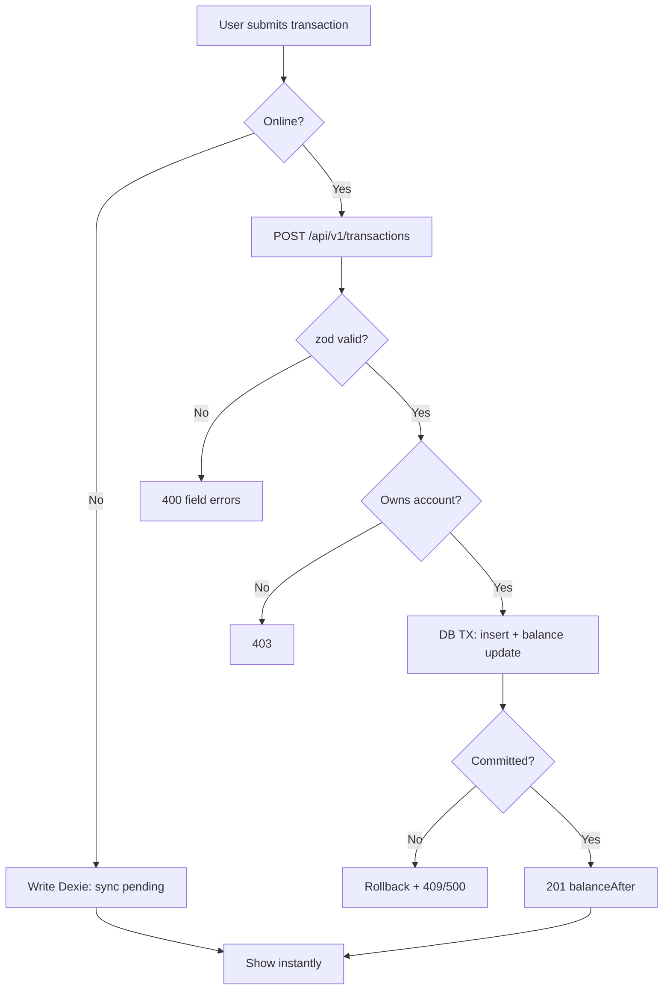
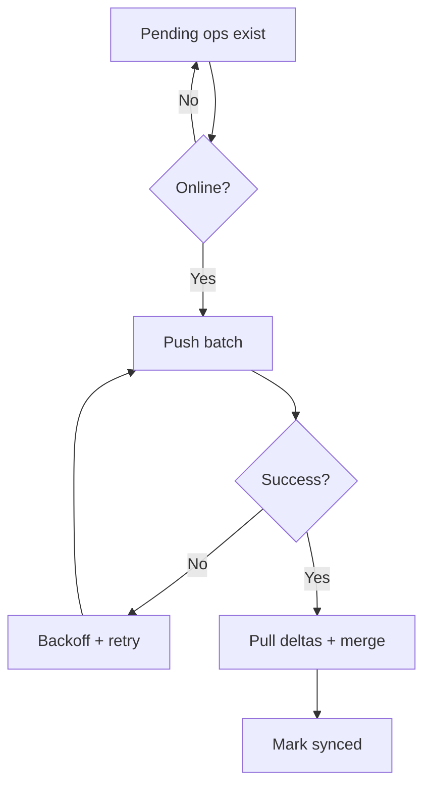

# Flowcharts — Kanaku

## Transaction Creation (with validation + atomicity)

```mermaid
flowchart TD
    A[User submits transaction] --> B{Online?}
    B -- No --> C[Write Dexie: sync pending]
    C --> Z[Show instantly]
    B -- Yes --> D[POST /api/v1/transactions]
    D --> E{zod valid?}
    E -- No --> F[400 field errors]
    E -- Yes --> G{Owns account?}
    G -- No --> H[403]
    G -- Yes --> I[DB TX: insert + balance update]
    I --> J{Committed?}
    J -- No --> K[Rollback + 409/500]
    J -- Yes --> L[201 balanceAfter]
    L --> Z
```

## Background Sync Retry

```mermaid
flowchart TD
    A[Pending ops exist] --> B{Online?}
    B -- No --> A
    B -- Yes --> C[Push batch]
    C --> D{Success?}
    D -- No --> E[Backoff + retry]
    E --> C
    D -- Yes --> F[Pull deltas + merge]
    F --> G[Mark synced]
```

