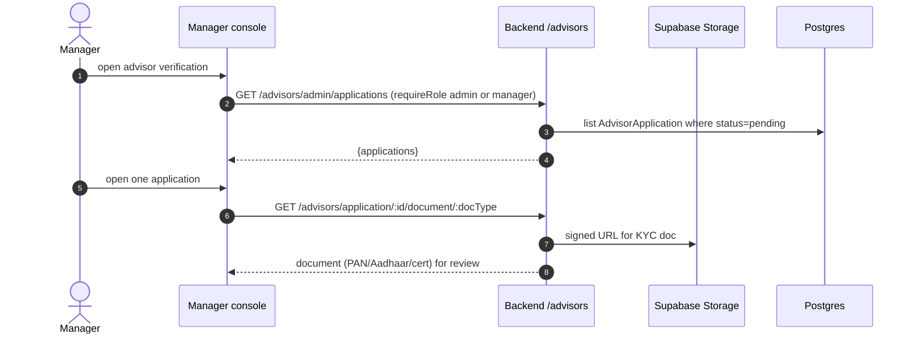
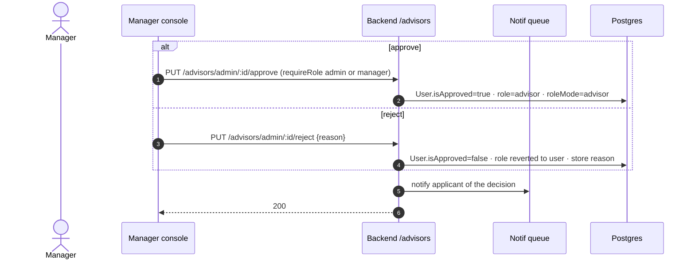
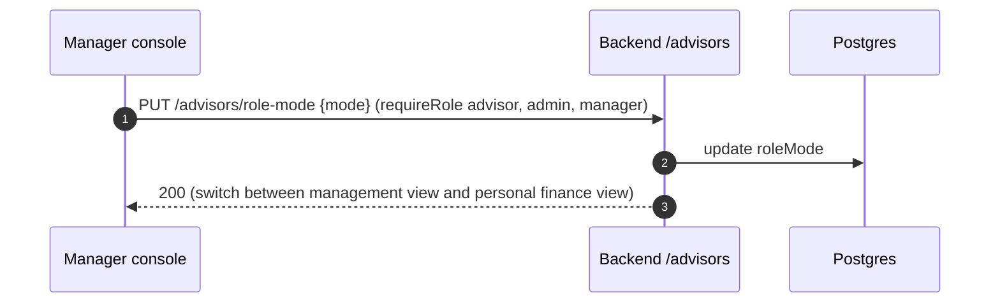

# Manager‑Role Feature Flows

A **manager** shares the advisor‑vetting capability with admins (`requireRole(['admin','manager'])`)
but not full user‑administration. Managers also retain personal‑finance features.
The manager‑specific flow is the advisor verification queue.

---

## 1. Advisor verification queue

## 2. Approve / reject an advisor

## 3. Role switch (manager workspace)

> Note: managers do **not** have `/admin/*` user‑management, platform‑settings, or
> AI‑intelligence routes — those require `requireRole('admin')`. See ADMIN_FLOWS.md.
