# Per-Module Sequence Diagrams — Kanaku

> Mermaid sequence diagrams for module flows. Complements the 16 diagrams in `KANAKU_PROJECT_OVERVIEW.md` §G (sign-up, add txn, receipt OCR, voice, goal, loan EMI, investments, group split, todos, advisor booking, advisor verification, admin gates, AA, cross-device sync, notifications, settings). This file adds the remaining modules and finer detail. All requests pass: helmet → cors → rateLimit → json → requestId → sanitiser → authenticate → validate(zod) → ownership.

## Accounts — CRUD with cache
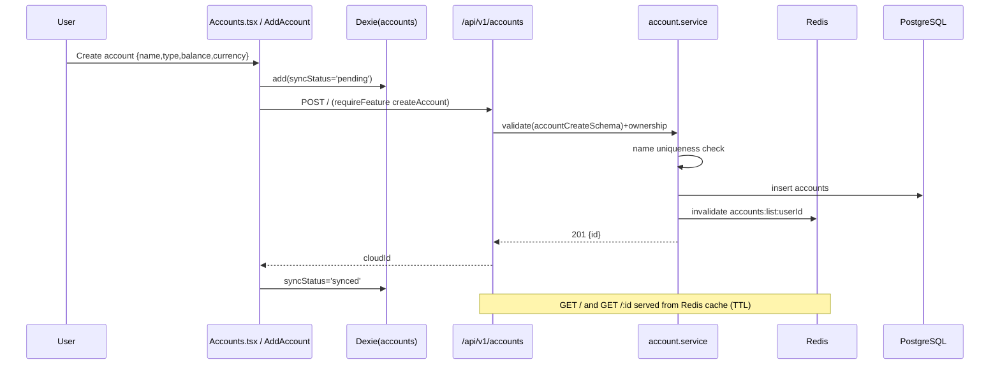

## Recurring transactions — auto-post worker
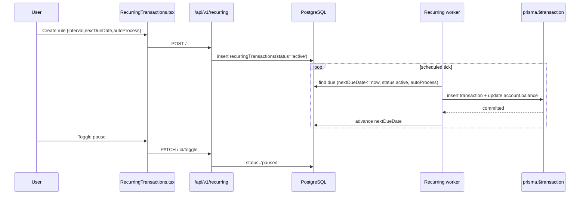

## Budgets — create, spend recalc, alerts
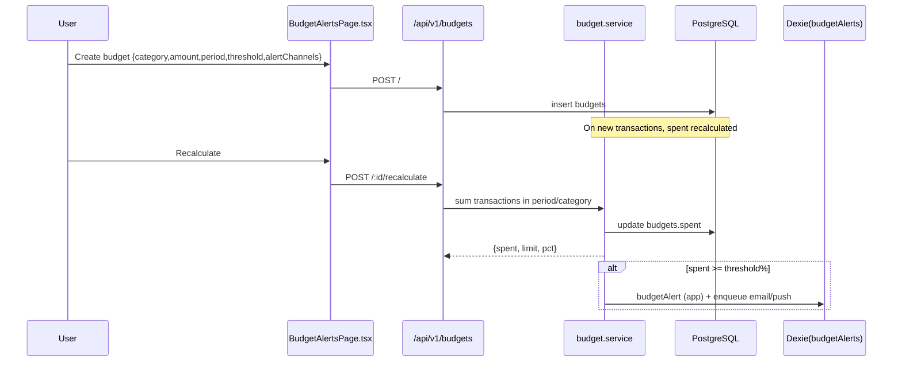

## Investments — add with live price + close
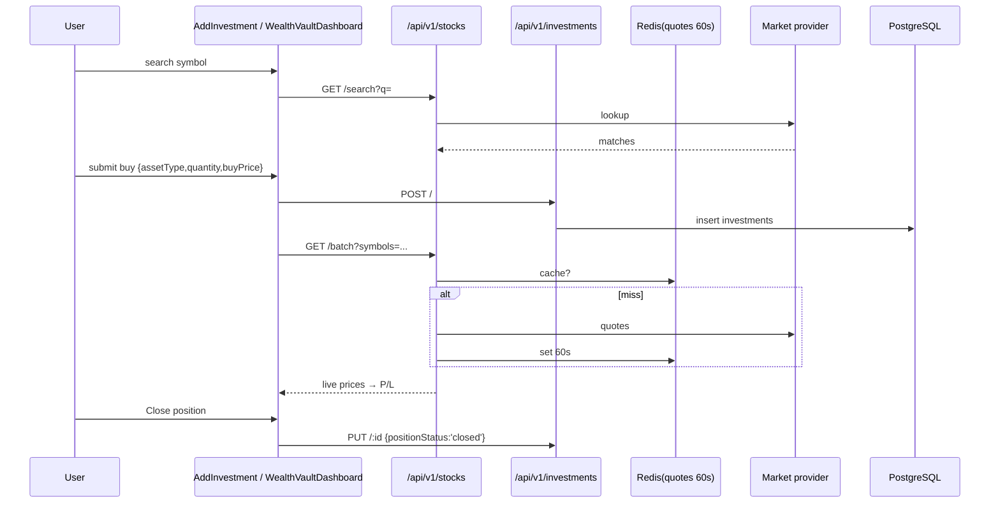

## Gold — position + live metal price
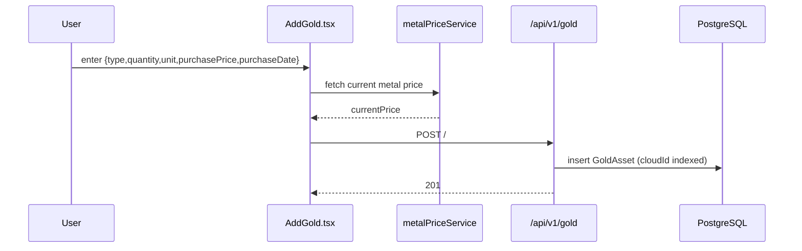

## Statement import — upload → review → confirm
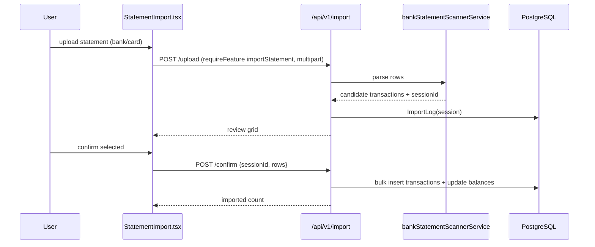

## SMS detection → linked transaction
```mermaid
sequenceDiagram
    participant DEV as Device (SMS)
    participant FE as smsTransactionDetectionService
    participant DX as Dexie(smsTransactions)
    participant API as /api/v1/transactions
    DEV->>FE: bank SMS received
    FE->>FE: parse amount/merchant/account
    FE->>DX: smsTransactions(status='detected', &sourceSmsId)
    FE-->>DEV: prompt "Add this expense?"
    DEV->>FE: confirm
    FE->>API: POST / (linked) → matchedAccountId
    API-->>FE: created; DX status='linked', linkedTransactionId
```

## Friends — create, bulk, CSV import
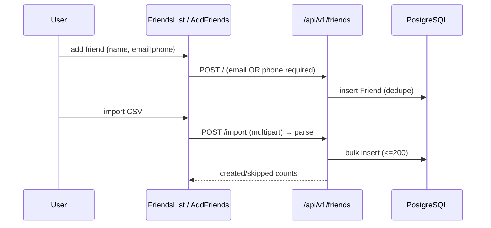

## Groups — split expense + realtime
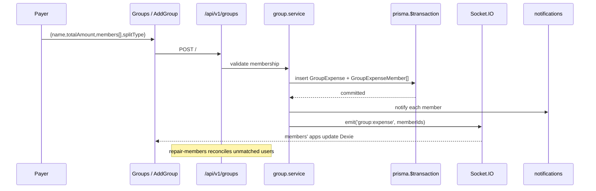

## To-Do (Together) — collaborate
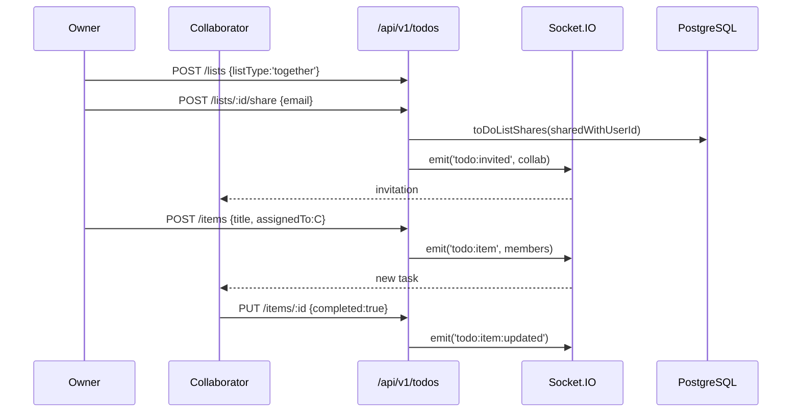

## Collaboration ACL — list / revoke
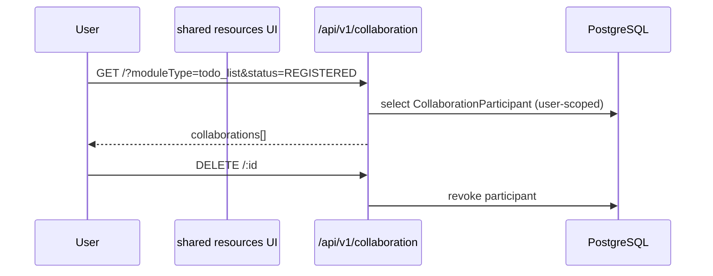

## Advisor chat session lifecycle
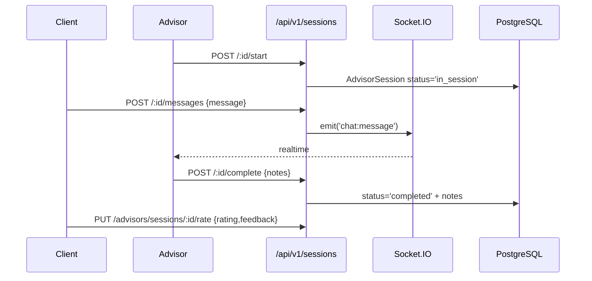

## Payments — intent state machine
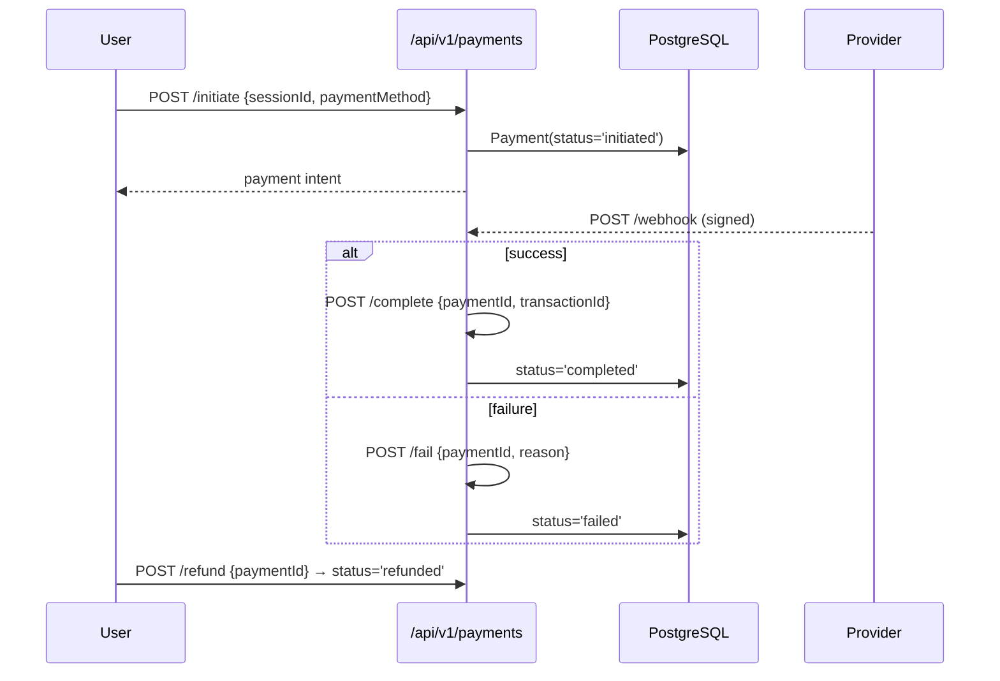

## OTP — sensitive action gate
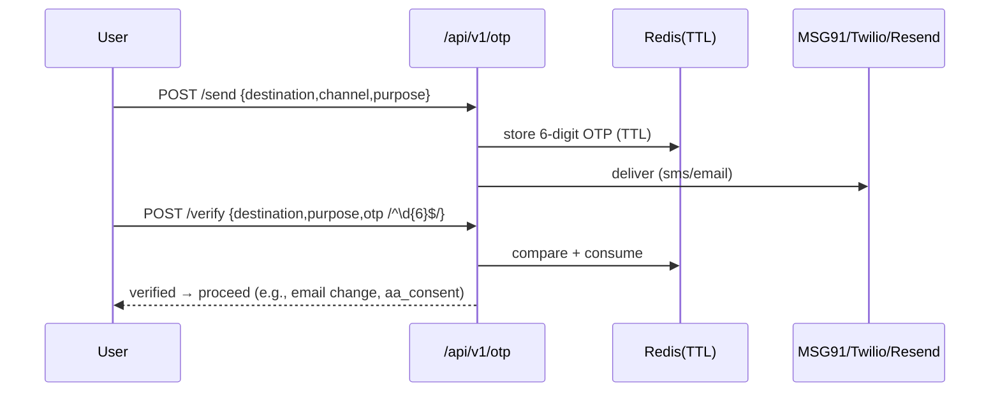

## Sessions/Devices — multi-device management
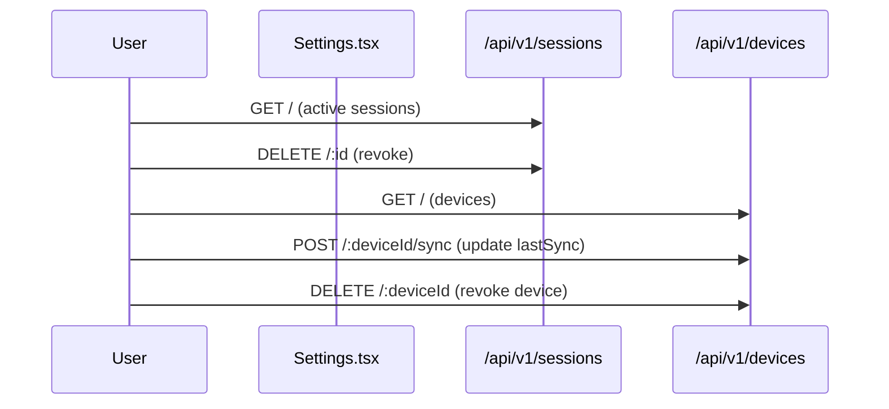

## Avatars / Profile
```mermaid
sequenceDiagram
    participant U as User
    participant FE as UserProfile.tsx
    participant API_A as /api/v1/avatars
    participant API_P as /api/v1/auth/profile
    U->>API_A: GET / (28 DiceBear)
    U->>API_A: PUT /me {avatarId}
    U->>API_P: PUT / {profile fields}
    Note over FE: PIN change → /pin/update; email/mobile change → OTP verify
```

## AI insights — capability-gated reads
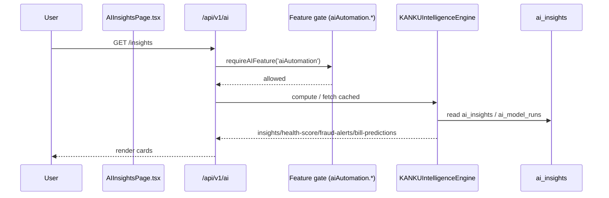

## Admin — user role/status management
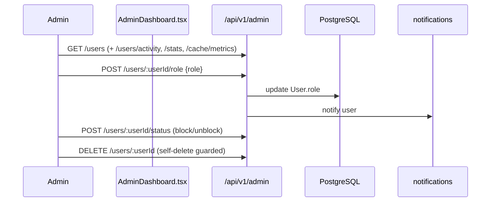

## Webhooks — SendGrid signed events
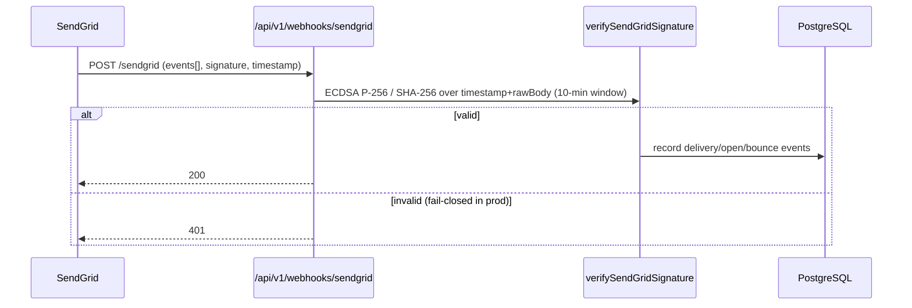

