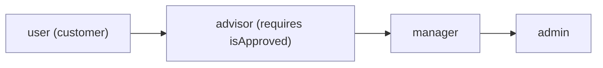
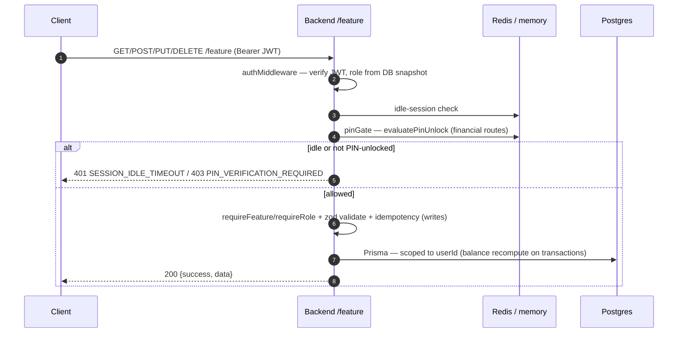
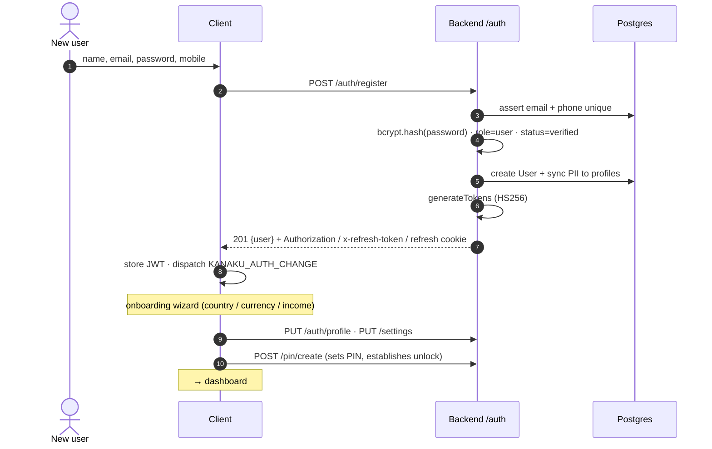
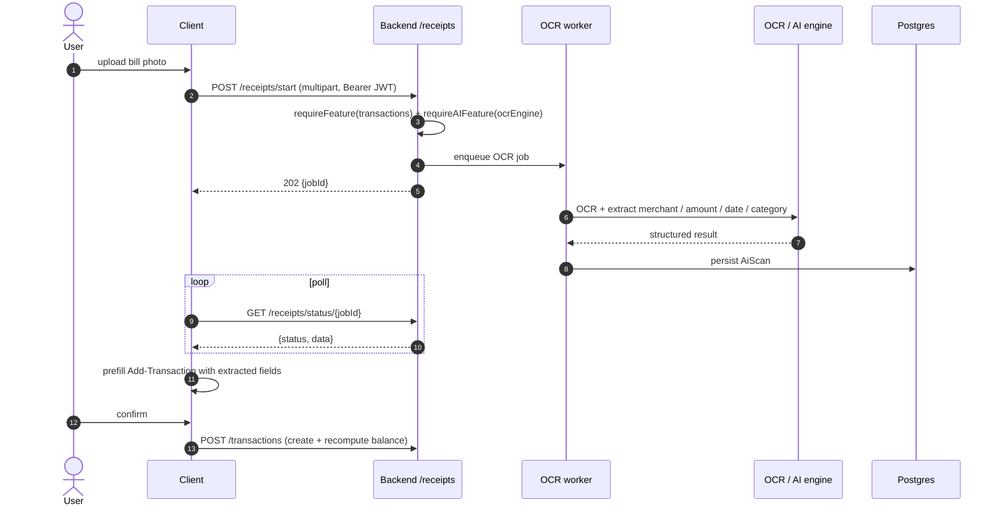
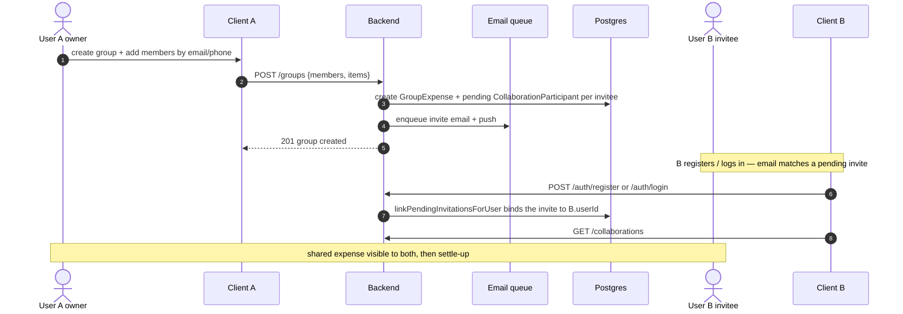
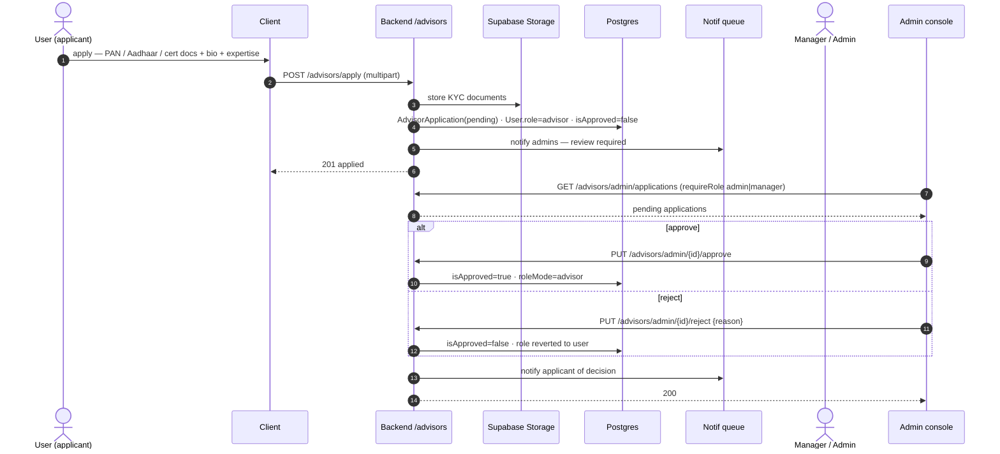
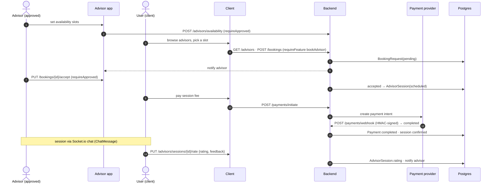
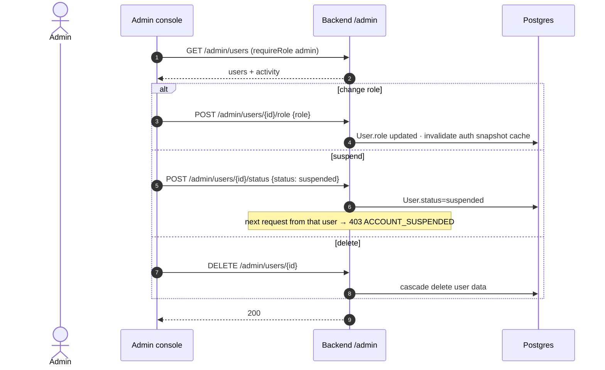
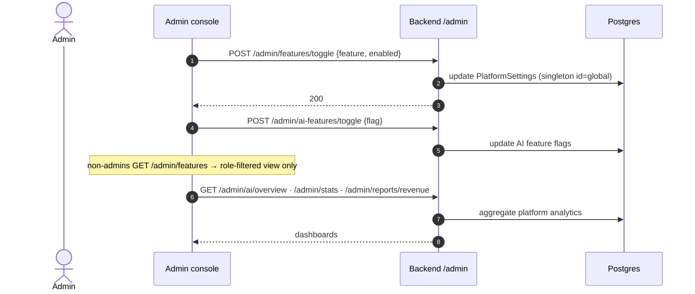

# Finora / Kanaku — Role- & Feature-Based Flows

Communication sequences organised by **role** and **feature**. The four core flows
(Login, PIN, Sync, Account Aggregator) live in
[SEQUENCE_DIAGRAMS.md](./SEQUENCE_DIAGRAMS.md); this doc covers everything else.

Rather than one diagram per CRUD endpoint (they're identical), the **Generic CRUD**
pattern below covers all the simple feature routes; the remaining diagrams are the
genuinely multi‑party flows.

---

## Roles & permission model

Four roles (`customer` is normalised to `user`): **user · advisor · manager · admin**.
Enforcement layers (in `middleware/`): `authMiddleware` (JWT, role from DB snapshot) →
`pinGate` (PIN unlock) → `requireRole` / `requireFeature` / `requireApproved` (RBAC) →
`ownerOnly` (resource ownership) → `auditLog`.

| Capability | user | advisor | manager | admin |
|---|:--:|:--:|:--:|:--:|
| Own finances (accounts/transactions/budgets/goals/loans/investments/gold) | ✅ | ✅ | ✅ | ✅ |
| Book an advisor (`bookAdvisor`) | ✅ | — | — | — |
| Manage availability / accept bookings (`requireApproved`) | — | ✅ | — | — |
| Approve/reject advisor applications | — | — | ✅ | ✅ |
| User management (role / suspend / delete) | — | — | — | ✅ |
| Platform settings & feature flags | — | — | — | ✅ |
| AI intelligence dashboards | — | — | — | ✅ |

---

## Generic CRUD (covers accounts · transactions · investments · loans · goals · budgets · recurring · tax · gold · settings)

---

## USER — registration & onboarding

---

## USER — receipt scan → OCR → transaction (async job)

---

## USER ↔ USER — group expense & collaboration invite

Invites use the unified `CollaborationParticipant` model; acceptance is **implicit** —
a pending invite keyed by email/phone is linked when that person registers or logs in
(`invitation.service.linkPendingInvitationsForUser`).

---

## USER → ADVISOR (applicant) → MANAGER/ADMIN — advisor application & approval

---

## USER ↔ ADVISOR — availability → booking → payment → session → rating

---

## ADMIN — user management

---

## ADMIN — platform settings & feature flags

---

### Cross-cutting (all flows)
- **Auth + idle gate** run on every protected request; **pinGate** on financial routes.
- **RBAC**: `requireRole` (role), `requireFeature` (FEATURE_PERMISSIONS matrix),
  `requireApproved` (advisor must be approved), `ownerOnly` (resource ownership).
- **Audit**: `auditLog` / `withAudit` records access to `AuditLog` (userId, action,
  resource, status, ip).
- **Async work** (email, push, OCR, sync) runs through BullMQ workers on Redis.
- **Inbound webhooks** (Setu AA, payments) are HMAC-verified and sit *before* auth.
