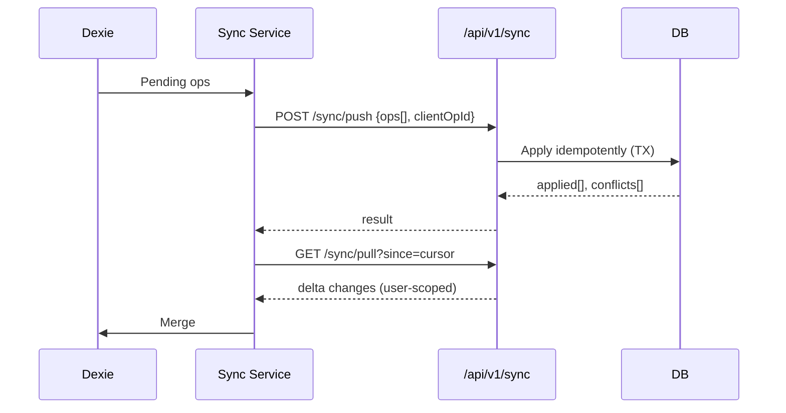
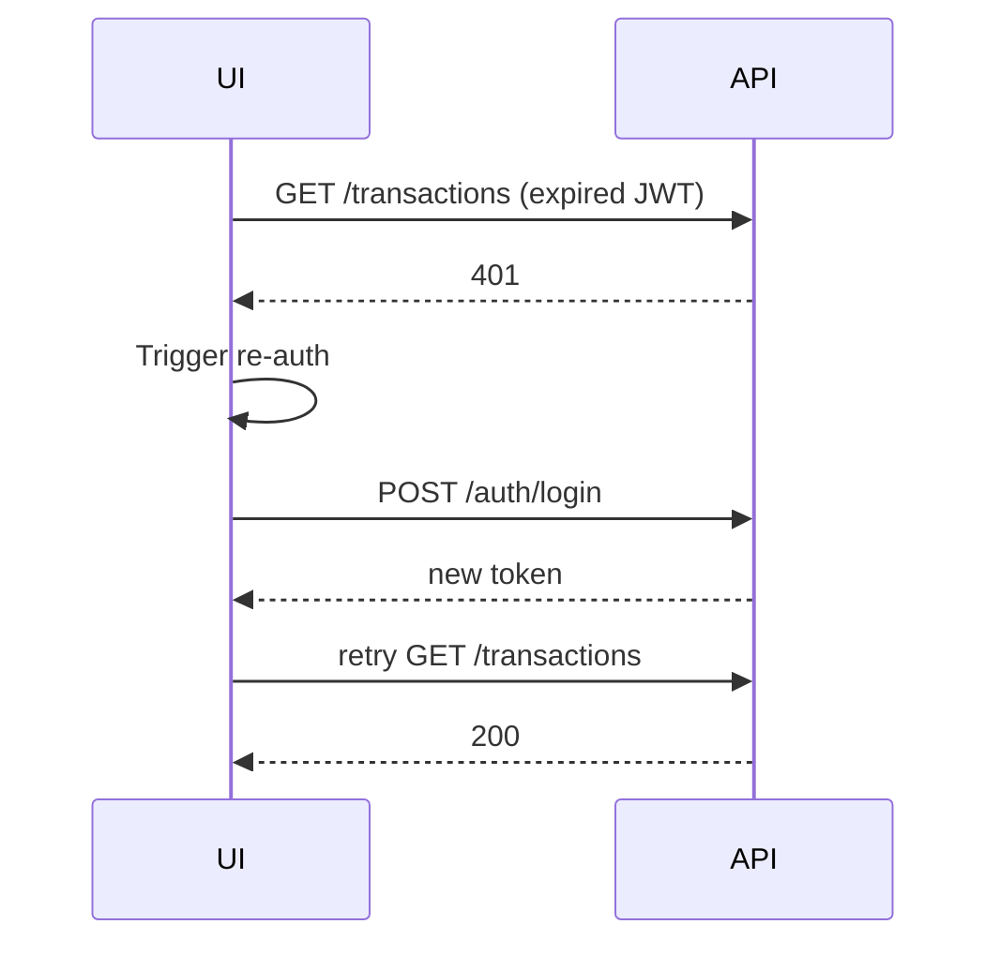

# Sequence Diagrams — App Flow

## Sync Push/Pull (delta, user-scoped)

```mermaid
sequenceDiagram
    participant Dexie
    participant Sync as Sync Service
    participant API as /api/v1/sync
    participant DB
    Dexie->>Sync: Pending ops
    Sync->>API: POST /sync/push {ops[], clientOpId}
    API->>DB: Apply idempotently (TX)
    DB-->>API: applied[], conflicts[]
    API-->>Sync: result
    Sync->>API: GET /sync/pull?since=cursor
    API-->>Sync: delta changes (user-scoped)
    Sync->>Dexie: Merge
```

## Token Expiry Re-Auth

```mermaid
sequenceDiagram
    participant UI
    participant API
    UI->>API: GET /transactions (expired JWT)
    API-->>UI: 401
    UI->>UI: Trigger re-auth
    UI->>API: POST /auth/login
    API-->>UI: new token
    UI->>API: retry GET /transactions
    API-->>UI: 200
```

