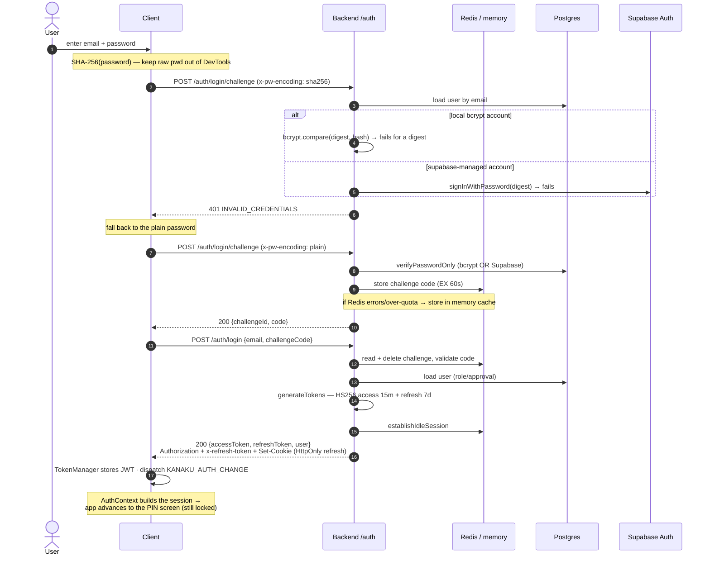
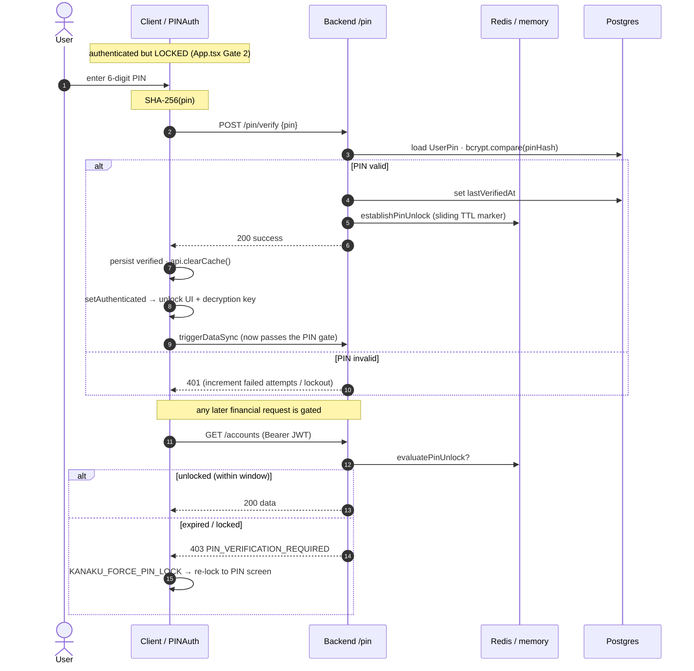
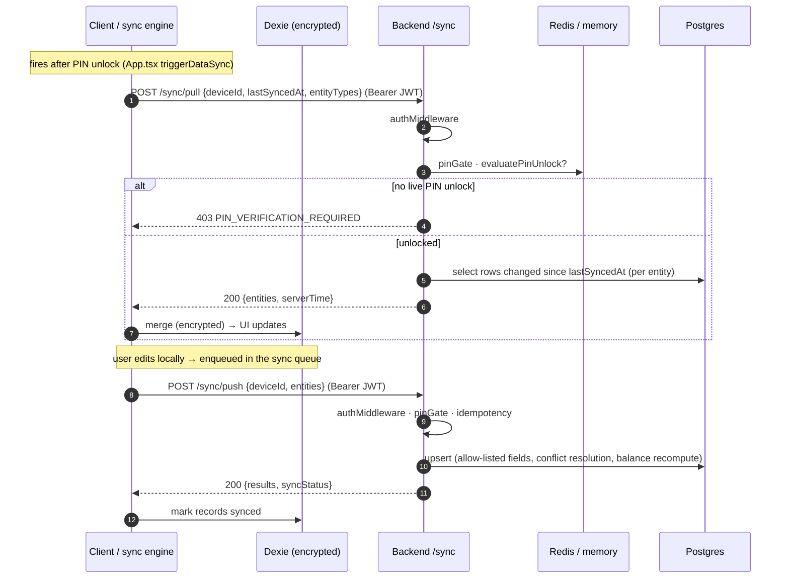
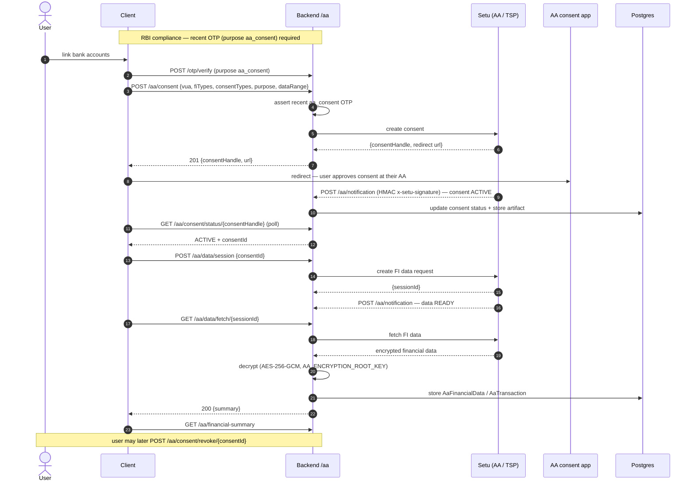

# Finora / Kanaku — Communication Sequence Diagrams

How the pieces actually talk to each other, for the four core flows.
See [ARCHITECTURE.md](./ARCHITECTURE.md) for the component view.

Conventions: `Bearer JWT` = the backend‑issued HS256 access token. `Redis` means
the cache‑with‑failover layer (which falls back to an in‑memory store on error).

---

## 1. Login (backend‑managed / BFF)

The client authenticates against our backend, which verifies the password (local
bcrypt or, for unmigrated accounts, Supabase) and issues **only** a backend JWT.
Login is a 2‑step challenge; the SHA‑256 attempt is a DevTools‑hygiene probe that
falls back to plain when the account verifies server‑side.

**Refresh (later):** `POST /auth/refresh` (HttpOnly cookie / `x-refresh-token`) →
backend verifies, rotates the pair, slides the idle window, returns new tokens.

---

## 2. PIN unlock (server‑enforced)

The PIN screen blocks the app until the PIN is verified **server‑side**, which
records a sliding "PIN unlocked" marker. Financial routes and private profile
fields then require that marker (when `PIN_GATE_ENABLED=true`).

---

## 3. Sync (offline‑first)

After PIN unlock, the client pulls changes into the encrypted Dexie store and
pushes local edits back. Both directions are PIN‑gated; pushes are idempotent.

---

## 4. Account Aggregator (RBI · Setu)

RBI‑compliant bank‑data linking. Consent creation requires a recent OTP. Setu
notifies the backend via **HMAC‑signed** webhooks (no user JWT). Fetched financial
data is decrypted (AES‑256‑GCM) and stored.

---

### Cross‑cutting notes

- **Every protected request** runs `authMiddleware` (verify backend JWT, role from
  DB snapshot — never token metadata) then the idle‑session check.
- **Rate limits:** login 5/min, refresh 10/min, OTP 5/10min, AA 20/min.
- **Webhooks** (Setu AA, payments) are verified by HMAC‑SHA256 over the raw body —
  they sit *before* `authMiddleware` because they're machine‑to‑machine.
