# User‑Role Feature Flows

Sequence diagram per **user** feature. Every protected call runs
`authMiddleware → idle‑session → pinGate` before reaching the controller (shown
once below, abbreviated as **auth+gate** thereafter). The encrypted **Dexie**
store is the local cache; the backend is the source of truth.

Cross‑role flows (advisor lifecycle, admin/manager ops) live in their own docs.

---

## 1. Dashboard

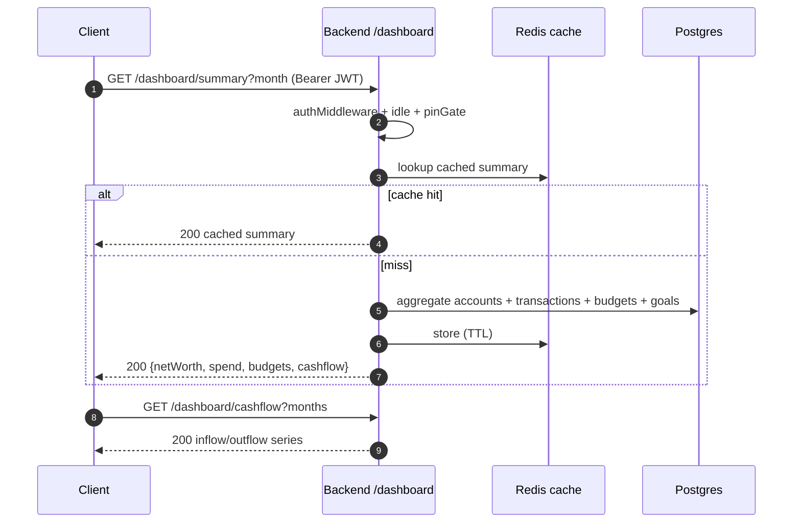

## 2. Accounts

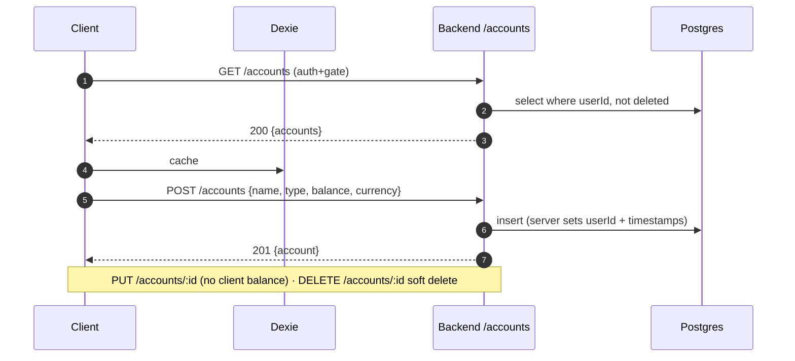

## 3. Transactions

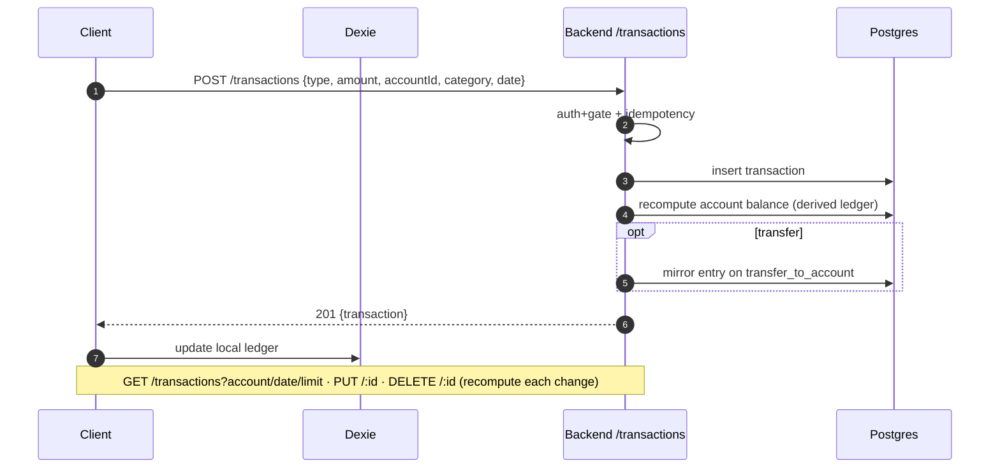

## 4. Calendar (client view)

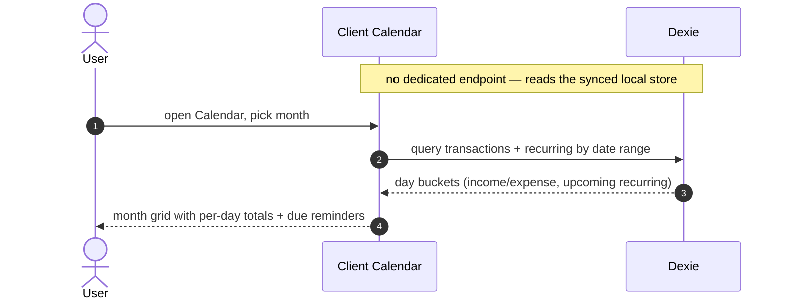

## 5. To‑Do Lists (with sharing)

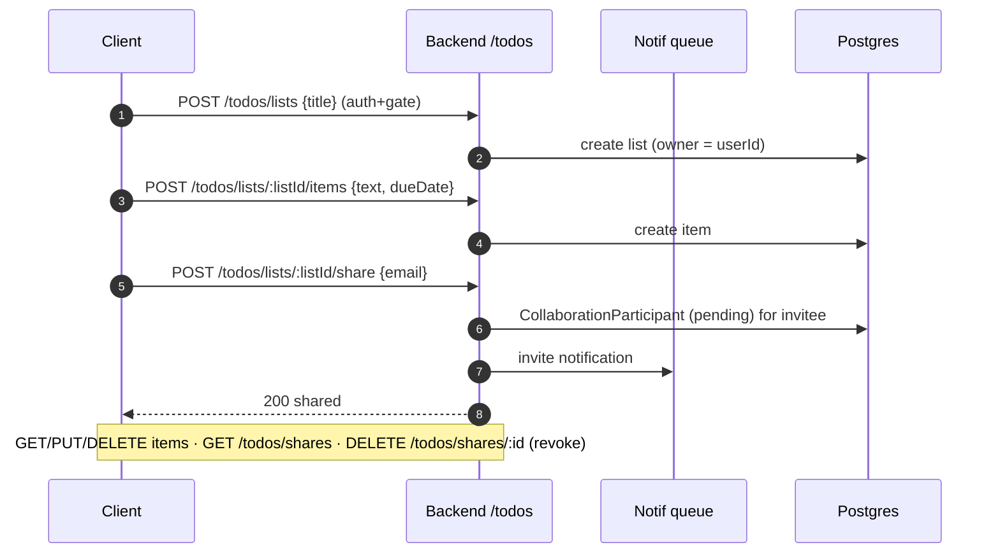

## 6. Goals (with members + progress)

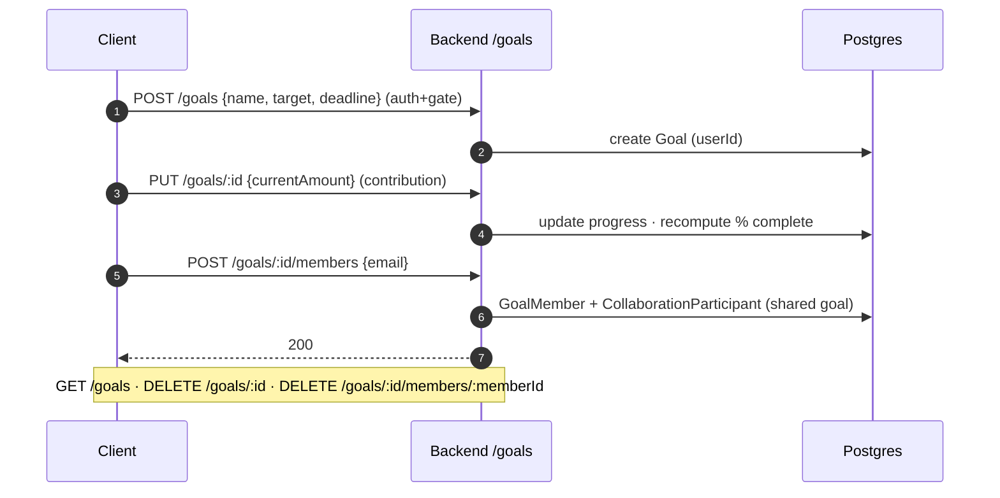

## 7. Group Expense (split + settle)

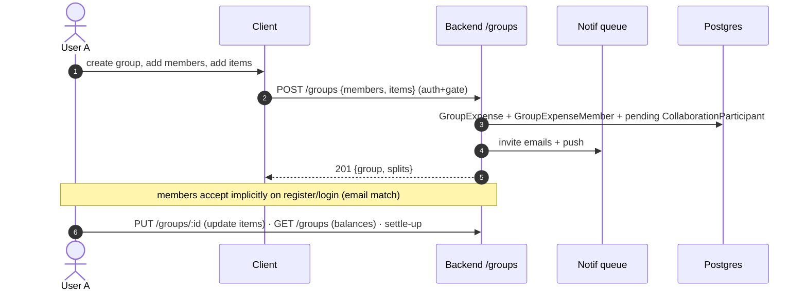

## 8. Book Advisor

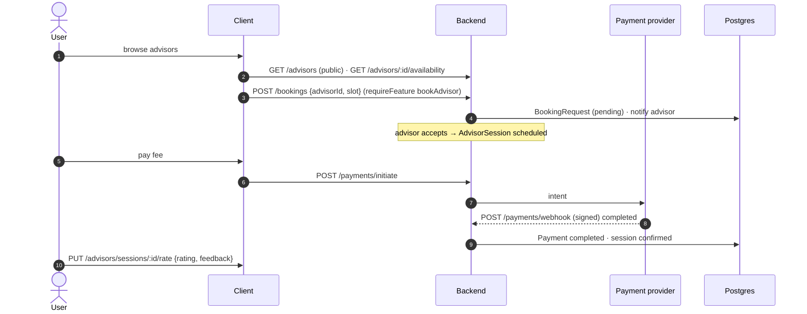

## 9. AI Insights

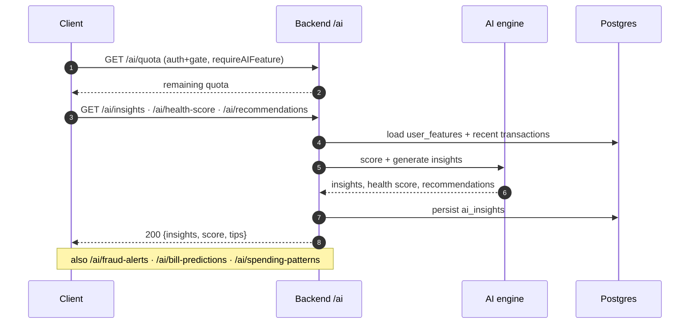

## 10. Budgets (with alerts)

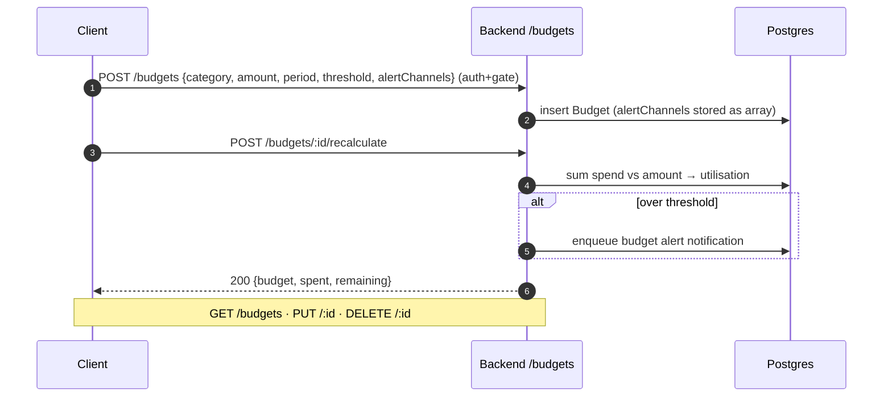

## 11. Recurring transactions

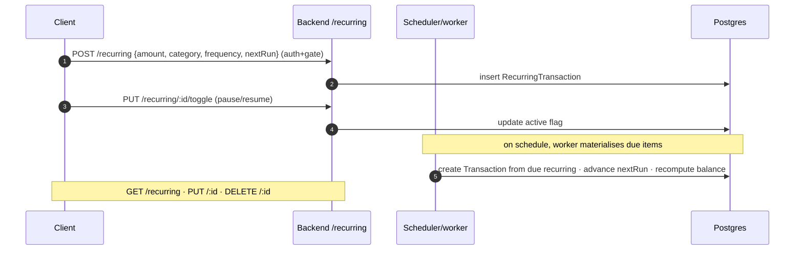

## 12. Investments

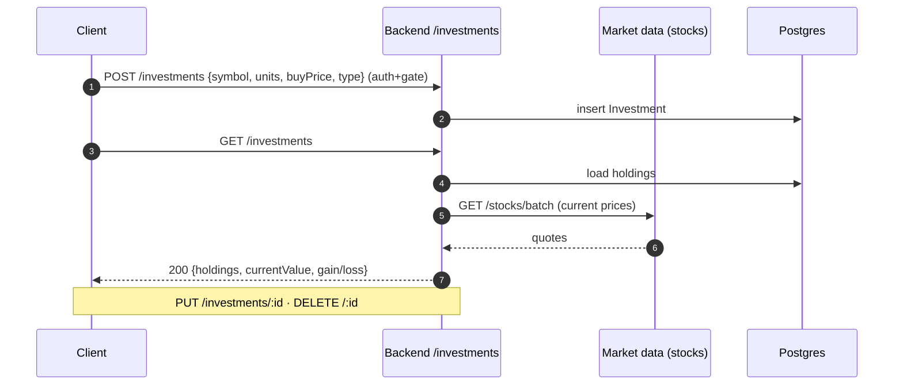

## 13. Loans (EMI)

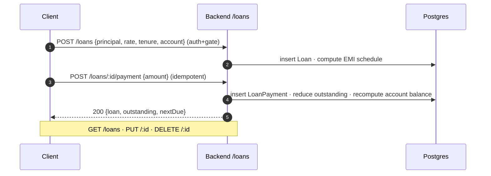

## 14. Reports (client view)

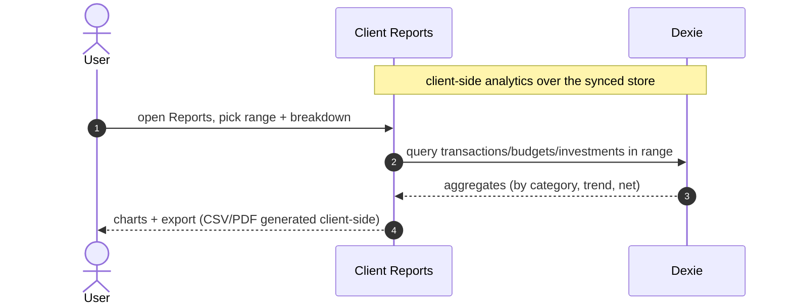

## 15. Voice logging

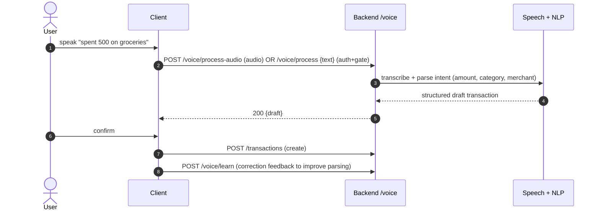

## 16. Receipt scanner (async OCR)

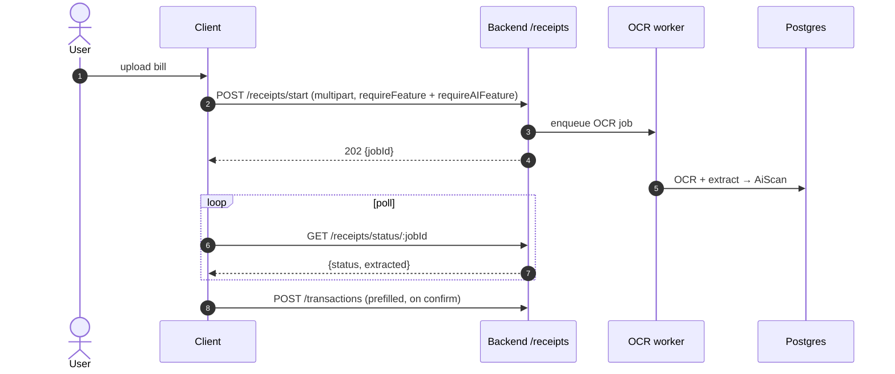

## 17. Notifications

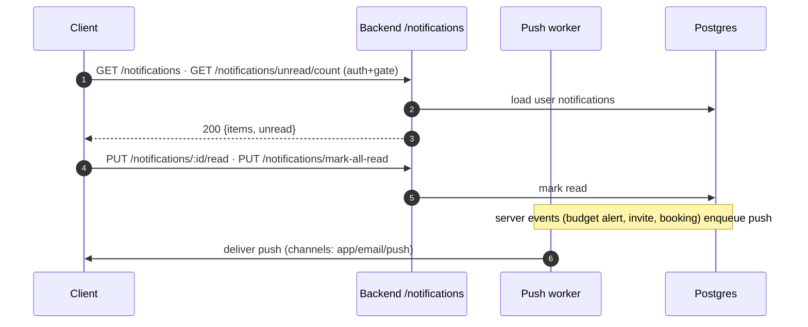

## 18. Profile

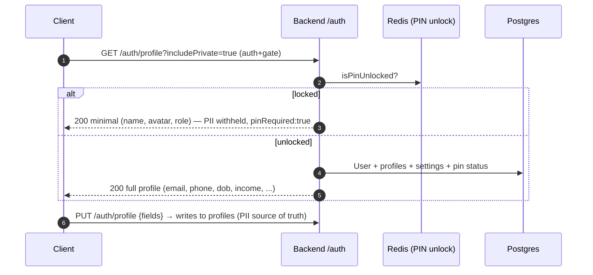

## 19. Settings

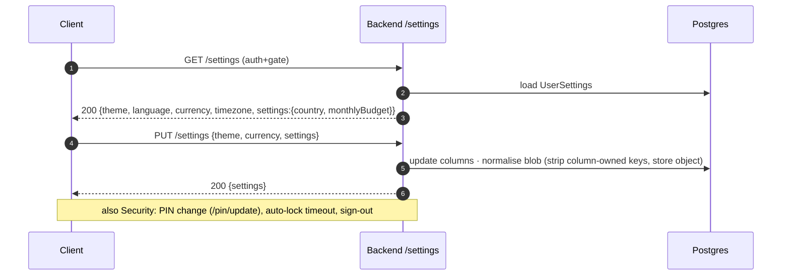
