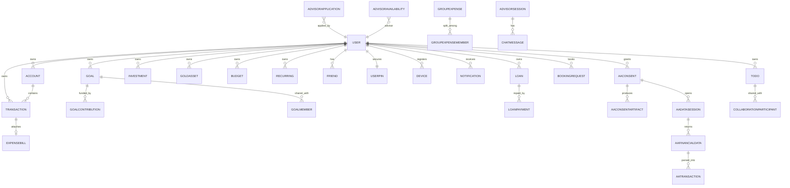

# ER Diagram — Kanaku (Core Relationships)

> Full model list (48) in `Database_Schema.md`. This diagram shows the principal money + collaboration + advisory + AA relationships.

Monetary integrity: `ACCOUNT.balance`, `GOAL.current`, `LOAN.outstanding` are server-authoritative `Decimal(18,2)`, updated only inside `prisma.$transaction`.
