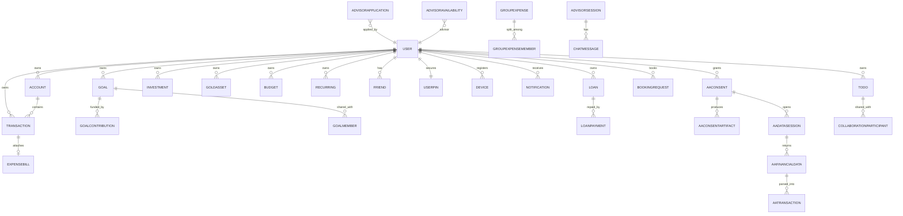

# Database Schema & Tables Definition — Kanaku

> Authoritative specification of the PostgreSQL cloud schema (Prisma) and the IndexedDB local-first database (Dexie v15).

---

## 1. Cloud Database Schema (PostgreSQL via Prisma)
The system of record is PostgreSQL, managed via Prisma (`backend/prisma/schema.prisma`). It consists of **48 models**. All monetary fields use the `Decimal(12,2)` or `Decimal(18,2)` data types for precise currency calculations.

### Model Inventory by Domain
- **Identity & Access:** `User`, `UserPin`, `UserSettings`, `RefreshToken`, `OtpCode`, `OtpRequest`, `Device`, `profiles`, `AuditLog`, `PlatformSettings`, `user_features`
- **Money Core:** `Account`, `Transaction`, `Category`, `RecurringTransaction`, `Budget`, `ImportLog`, `Payment`
- **Wealth:** `Investment`, `GoldAsset`, `Goal`, `GoalContribution`, `GoalMember`, `Loan`, `LoanPayment`
- **Bills & Receipts:** `ExpenseBill`, `AiScan`
- **Social & Collaboration:** `Friend`, `GroupExpense`, `GroupExpenseMember`, `CollaborationParticipant`, `Todo`, `ChatMessage`
- **Advisory:** `AdvisorApplication`, `AdvisorAvailability`, `AdvisorSession`, `BookingRequest`
- **Sync & Operations:** `SyncQueue`, `Notification`
- **AI Engine:** `ai_events`, `ai_insights`, `ai_model_runs`
- **Account Aggregator (Setu):** `AaConsent`, `AaConsentArtifact`, `AaDataSession`, `AaFinancialData`, `AaTransaction`

### Key Cloud Tables & Primary Fields
- **User:** `id (UUID PK)`, `email`, `password (Argon2id)`, `role (admin/manager/advisor/user)`, `currency (char 3)`, `isApproved (bool)`
- **Account:** `id (UUID PK)`, `userId (FK)`, `name`, `type (bank/card/cash/digital)`, `currency (char 3)`, `balance (Decimal 18,2)`, `isActive`, `syncStatus`
- **Transaction:** `id (UUID PK)`, `userId (FK)`, `accountId (FK)`, `type (income/expense/transfer/withdrawal)`, `amount (Decimal 18,2)`, `category`, `description`, `date (timestamp)`, `attachment (document:id)`
- **Goal:** `id (UUID PK)`, `userId (FK)`, `target (Decimal)`, `current (Decimal)`, `targetDate`, `isGroupGoal`
- **Loan:** `id (UUID PK)`, `userId (FK)`, `principal (Decimal)`, `outstanding (Decimal)`, `interestRate (Decimal)`, `dueDate`, `friendId (FK)`, `status`

---

## 2. Local Database Schema (IndexedDB via Dexie v15)
The local client-side database runs on IndexedDB on mobile or web view devices, acting as the offline-first source of truth. Every record includes `syncStatus` (`pending`, `syncing`, `synced`, `conflict`, or `failed`).

### Local Tables Index
- **`accounts`**: `++id`, `remoteId`, `cloudId`, `type`, `isActive`, `syncStatus`
- **`transactions`**: `++id`, `remoteId`, `cloudId`, `type`, `accountId`, `category`, `date`, `syncStatus`
- **`friends`**: `++id`, `remoteId`, `cloudId`, `name`, `createdAt`, `syncStatus`
- **`loans`**: `++id`, `remoteId`, `cloudId`, `type`, `status`, `dueDate`, `friendId`, `syncStatus`
- **`loanPayments`**: `++id`, `loanId`, `date`
- **`goals`**: `++id`, `remoteId`, `cloudId`, `isGroupGoal`, `targetDate`, `syncStatus`
- **`goalContributions`**: `++id`, `goalId`, `date`
- **`groupExpenses`**: `++id`, `remoteId`, `cloudId`, `date`, `syncStatus`
- **`investments`**: `++id`, `remoteId`, `cloudId`, `assetType`, `positionStatus`, `syncStatus`
- **`gold`**: `++id`, `type`, `unit`, `purchaseDate`, `cloudId`
- **`budgets`**: `id`, `category`, `period`
- **`budgetAlerts`**: `++id`, `budgetId`, `type`, `isRead`, `triggeredAt`
- **`recurringTransactions`**: `++id`, `cloudId`, `accountId`, `type`, `nextDueDate`, `status`, `syncStatus`
- **`toDoLists`**: `++id`, `cloudId`, `ownerId`, `listType`, `archived`, `syncStatus`
- **`toDoItems`**: `++id`, `cloudId`, `listId`, `completed`, `dueDate`, `assignedTo`, `syncStatus`
- **`smsTransactions`**: `++id`, `&sourceSmsId`, `userId`, `status`, `date`, `matchedAccountId`, `linkedTransactionId`
- **`syncQueue`**: `++id`, `userId`, `table`, `status`, `createdAt`

### Local Schema History (Evolution)
- **v12:** Core financial tables baseline (accounts, transactions, goals).
- **v13:** Added `toDoLists.listType` and `toDoItems.assignedTo` to support shared task collaboration.
- **v14:** Added `recurringTransactions` and `budgetAlerts`.
- **v15:** Added indexing for `gold.cloudId` to guarantee proper cross-device replication and conflict merging.

---

## 3. Entity Relationship Diagram (ERD)
This diagram illustrates the database relationships mapping users, money accounts, wealth records, and advisors.

