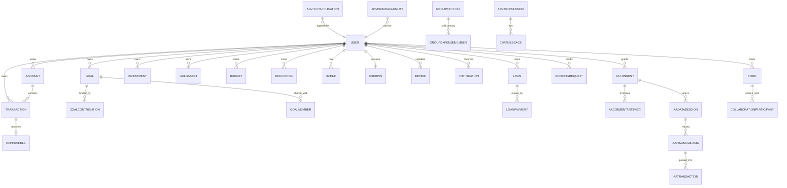

# Database Schema & Tables Definition — Kanaku

> Authoritative specification of the PostgreSQL cloud schema (Prisma) and the IndexedDB local-first database (Dexie v15).

---

## 1. Cloud Database Schema (PostgreSQL via Prisma)
The system of record is PostgreSQL, managed via Prisma (`backend/prisma/schema.prisma`). It consists of **48 models**. All monetary fields use the `Decimal(12,2)` or `Decimal(18,2)` data types for precise currency calculations.

### Model Inventory by Domain
- **Identity & Access:** `User`, `UserPin`, `UserSettings`, `RefreshToken`, `OtpCode`, `OtpRequest`, `Device`, `profiles`, `AuditLog`, `PlatformSettings`, `user_features`
- **Money Core:** `Account`, `Transaction`, `Category`, `RecurringTransaction`, `Budget`, `ImportLog`, `Payment`
- **Wealth:** `Investment`, `GoldAsset`, `Goal`, `GoalContribution`, `GoalMember`, `Loan`, `LoanPayment`
- **Bills & Receipts:** `ExpenseBill`, `AiScan`
- **Social & Collaboration:** `Friend`, `GroupExpense`, `GroupExpenseMember`, `CollaborationParticipant`, `Todo`, `ChatMessage`
- **Advisory:** `AdvisorApplication`, `AdvisorAvailability`, `AdvisorSession`, `BookingRequest`
- **Sync & Operations:** `SyncQueue`, `Notification`
- **AI Engine:** `ai_events`, `ai_insights`, `ai_model_runs`
- **Account Aggregator (Setu):** `AaConsent`, `AaConsentArtifact`, `AaDataSession`, `AaFinancialData`, `AaTransaction`

### Key Cloud Tables & Primary Fields
- **User:** `id (UUID PK)`, `email`, `password (Argon2id)`, `role (admin/manager/advisor/user)`, `currency (char 3)`, `isApproved (bool)`
- **Account:** `id (UUID PK)`, `userId (FK)`, `name`, `type (bank/card/cash/digital)`, `currency (char 3)`, `balance (Decimal 18,2)`, `isActive`, `syncStatus`
- **Transaction:** `id (UUID PK)`, `userId (FK)`, `accountId (FK)`, `type (income/expense/transfer/withdrawal)`, `amount (Decimal 18,2)`, `category`, `description`, `date (timestamp)`, `attachment (document:id)`
- **Goal:** `id (UUID PK)`, `userId (FK)`, `target (Decimal)`, `current (Decimal)`, `targetDate`, `isGroupGoal`
- **Loan:** `id (UUID PK)`, `userId (FK)`, `principal (Decimal)`, `outstanding (Decimal)`, `interestRate (Decimal)`, `dueDate`, `friendId (FK)`, `status`

---

## 1a. Activity Trail (`AuditLog`)

Every create/update/delete on a business model produces an `AuditLog` row. This is
not per-controller instrumentation — it is a Prisma client extension in
`backend/src/db/prisma.ts`, so **every** write path is covered: REST controllers,
the sync service, background workers and maintenance scripts alike.

**Columns:** `userId`, `actorRole`, `action` (`data.create` / `data.update` /
`data.delete`, or a named event such as `auth.login`), `resource`
(`"Model:id"`), `resourceType`, `resourceId`, `status`, `ip`, `userAgent`,
`requestId`, `details (Json)`, `createdAt`.

`actorRole` is denormalised deliberately: roles change, and an audit row must
keep describing the moment it recorded. It makes "everything a manager did" an
indexed scan rather than a join against the actor's *current* role.

**Two coverage tiers** (`AUDIT_MODELS_FULL` / `AUDIT_MODELS_LIGHT`):

| Tier | Models | `details` holds |
| --- | --- | --- |
| FULL | money, identity, permissions, ownership, advisory commitments, vault | `before` **and** `after` |
| LIGHT | notifications, devices, scans, todos, feed, AA, snapshots | `after` only |

FULL performs a read before the write to capture `before`. That is a second
round trip, and this deployment's database is a region away from its API
(~280 ms RTT), so it is spent only where the prior value settles a dispute.

**Explicitly excluded:** `AuditLog` (the interceptor would recurse),
`VaultAuditLog` (already a trail), `ApiIdempotencyKey` (request plumbing that
churns on every mutating request). A model in none of the three sets fails the
guard test in `quality/backend/tests/integration/audit-requestid.test.ts`, so a
new table cannot silently escape auditing.

**Immutability & retention:** the `auditlog_immutable` trigger refuses every
`UPDATE`, and refuses `DELETE` inside a 730-day window. Outside that window
deletes are permitted so `cleanup.worker.ts` can age the table out in batches —
without that exception a trail nobody can prune eventually has to be switched
off, which is worse than a bounded one. The worker's `AUDIT_RETENTION_DAYS` is
the ceiling; the trigger's constant is the floor. Keep them in step.

**Secrets:** `AUDIT_SENSITIVE_FIELDS` blanks columns that the generic `redact()`
key-matcher misses — `OtpCode.code` is a bare "code", `encryptionIv` reads like
metadata. An audit trail that records the OTP it just issued is worse than none.

---

## 2. Local Database Schema (IndexedDB via Dexie v15)
The local client-side database runs on IndexedDB on mobile or web view devices, acting as the offline-first source of truth. Every record includes `syncStatus` (`pending`, `syncing`, `synced`, `conflict`, or `failed`).

### Local Tables Index
- **`accounts`**: `++id`, `remoteId`, `cloudId`, `type`, `isActive`, `syncStatus`
- **`transactions`**: `++id`, `remoteId`, `cloudId`, `type`, `accountId`, `category`, `date`, `syncStatus`
- **`friends`**: `++id`, `remoteId`, `cloudId`, `name`, `createdAt`, `syncStatus`
- **`loans`**: `++id`, `remoteId`, `cloudId`, `type`, `status`, `dueDate`, `friendId`, `syncStatus`
- **`loanPayments`**: `++id`, `loanId`, `date`
- **`goals`**: `++id`, `remoteId`, `cloudId`, `isGroupGoal`, `targetDate`, `syncStatus`
- **`goalContributions`**: `++id`, `goalId`, `date`
- **`groupExpenses`**: `++id`, `remoteId`, `cloudId`, `date`, `syncStatus`
- **`investments`**: `++id`, `remoteId`, `cloudId`, `assetType`, `positionStatus`, `syncStatus`
- **`gold`**: `++id`, `type`, `unit`, `purchaseDate`, `cloudId`
- **`budgets`**: `id`, `category`, `period`
- **`budgetAlerts`**: `++id`, `budgetId`, `type`, `isRead`, `triggeredAt`
- **`recurringTransactions`**: `++id`, `cloudId`, `accountId`, `type`, `nextDueDate`, `status`, `syncStatus`
- **`toDoLists`**: `++id`, `cloudId`, `ownerId`, `listType`, `archived`, `syncStatus`
- **`toDoItems`**: `++id`, `cloudId`, `listId`, `completed`, `dueDate`, `assignedTo`, `syncStatus`
- **`smsTransactions`**: `++id`, `&sourceSmsId`, `userId`, `status`, `date`, `matchedAccountId`, `linkedTransactionId`
- **`syncQueue`**: `++id`, `userId`, `table`, `status`, `createdAt`

### Local Schema History (Evolution)
- **v12:** Core financial tables baseline (accounts, transactions, goals).
- **v13:** Added `toDoLists.listType` and `toDoItems.assignedTo` to support shared task collaboration.
- **v14:** Added `recurringTransactions` and `budgetAlerts`.
- **v15:** Added indexing for `gold.cloudId` to guarantee proper cross-device replication and conflict merging.

---

## 3. Entity Relationship Diagram (ERD)
This diagram illustrates the database relationships mapping users, money accounts, wealth records, and advisors.

```mermaid
erDiagram
    USER ||--o{ ACCOUNT : owns
    USER ||--o{ TRANSACTION : owns
    USER ||--o{ GOAL : owns
    USER ||--o{ LOAN : owns
    USER ||--o{ INVESTMENT : owns
    USER ||--o{ GOLDASSET : owns
    USER ||--o{ BUDGET : owns
    USER ||--o{ RECURRING : owns
    USER ||--o{ FRIEND : has
    USER ||--|| USERPIN : secures
    USER ||--o{ DEVICE : registers
    USER ||--o{ NOTIFICATION : receives
    USER ||--o{ AACONSENT : grants

    ACCOUNT ||--o{ TRANSACTION : contains
    TRANSACTION ||--o| EXPENSEBILL : attaches
    GOAL ||--o{ GOALCONTRIBUTION : funded_by
    GOAL ||--o{ GOALMEMBER : shared_with
    LOAN ||--o{ LOANPAYMENT : repaid_by
    GROUPEXPENSE ||--o{ GROUPEXPENSEMEMBER : split_among

    USER ||--o{ BOOKINGREQUEST : books
    ADVISORAPPLICATION }o--|| USER : applied_by
    ADVISORAVAILABILITY }o--|| USER : advisor
    ADVISORSESSION ||--o{ CHATMESSAGE : has

    AACONSENT ||--o{ AACONSENTARTIFACT : produces
    AACONSENT ||--o{ AADATASESSION : opens
    AADATASESSION ||--o{ AAFINANCIALDATA : returns
    AAFINANCIALDATA ||--o{ AATRANSACTION : parsed_into

    USER ||--o{ TODO : owns
    TODO ||--o{ COLLABORATIONPARTICIPANT : shared_with
```
