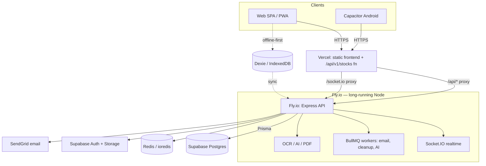

# Architecture Enhancement & Security — Program Summary

Capstone for the architecture/security overhaul (branch `chore/workspace-consolidation`).
This document is the **deliverables index** (§10), the **Supabase recommendation**
(§9), the **architecture diagram**, and the **security review summary**.

## Phase ledger

| Phase | Outcome | Commit |
|---|---|---|
| 0 | npm workspaces — collapsed 3 competing project defs into one | `b47fbb9a` |
| — | Vercel build fix — pinned rolldown platform bindings | `8a1e8fe0` |
| 1 | Untracked committed secrets / DBs / junk + `.gitignore` | `526166e3` |
| 2 | Backend module catalog + 36 per-module READMEs | `729faac9` |
| 3 | OAuth: `POST /auth/refresh` + token typing + `expiresAt` (§1) | `9060cff9` |
| 4 | Security module facade + controls catalog; injection audit (§5/§6) | `46da6692` |
| 5 | `emails/` module: providers/templates/services (§8) | `5f2e85a6` |
| 6 | Frontend architecture map + folder READMEs (§2) | `6a811fb0` |
| 7 | Database schema catalog + API catalog (§4/§7) | `c270e93d` |
| 8 | This document — Supabase decision + deliverables (§9/§10) | _this commit_ |

## Architecture diagram

- **Frontend:** React + Vite (rolldown) + Dexie offline-first; deployed to Vercel (static), which proxies `/api/*` and `/socket.io` to Fly and serves `/api/v1/stocks` as a Vercel function.
- **Backend:** long-running Express on Fly.io — REST (`/api/v1/*`, 238 endpoints / 36 modules), Socket.IO, BullMQ workers, OCR/AI.
- **Data:** Supabase Postgres (via Prisma, 48 models) + Redis; Supabase Auth + Storage; SendGrid for email.

## §9 — Supabase: Fly.io + Supabase vs Fully Supabase

**Current usage:** Supabase provides Postgres (via Prisma `DATABASE_URL`), Auth
(hybrid — custom JWT *and* Supabase JWT verified in [`middleware/auth.ts`](../backend/src/middleware/auth.ts)),
and Storage ([`utils/storage.ts`](../backend/src/utils/storage.ts)). Fly hosts the Node runtime.

| Capability | Today | Supabase fit |
|---|---|---|
| Auth | Hybrid custom-JWT + Supabase JWT | ✅ strong — but the hybrid is a complexity smell |
| Database | Supabase Postgres via Prisma | ✅ strong |
| Storage | Supabase Storage | ✅ strong |
| Email | SendGrid | Supabase Auth emails only cover auth flows |
| RLS | Not the primary guard (app-layer RBAC) | ⚠️ available; add as defense-in-depth |
| Realtime | Socket.IO on Fly | ❌ Supabase Realtime ≠ Socket.IO semantics |
| Background jobs | BullMQ workers + cron on Fly | ❌ Edge Functions are short-lived/stateless |
| Heavy compute | Tesseract OCR, PDF, sharp, AI (Node) | ❌ needs a Node runtime, not Deno edge |

### Recommendation: **keep Fly.io + Supabase** (do not go fully-Supabase)

The backend has substantial **long-running and stateful** workloads — Socket.IO,
BullMQ queues/workers, cron, and CPU-heavy OCR/AI with native Node deps
(`sharp`, `tesseract.js`, `pdf-parse`, `firebase-admin`). These do **not** fit
Supabase Edge Functions (short-lived, stateless, Deno). A "fully Supabase" move
would require rewriting that surface and is not worth it.

**But tighten the boundary:**
1. **Consolidate auth to one issuer.** The dual custom-JWT + Supabase-JWT path is
   the biggest source of auth complexity (see Phase 3). Pick Supabase Auth as the
   token source of truth *or* the custom JWT — not both — and make the other a
   thin adapter. Phase 3's `/auth/refresh` + token typing is a step toward a clean,
   single contract.
2. **Use Supabase Storage** as the canonical file store (already started).
3. **Enable RLS** on Supabase tables as defense-in-depth behind the app-layer RBAC.
4. Keep Fly as the home for realtime, queues, and heavy compute.

## §10 — Deliverables index

| Deliverable | Where |
|---|---|
| Architecture diagram | this doc (above) + [`ARCHITECTURE_DIAGRAMS.md`](./ARCHITECTURE_DIAGRAMS.md) |
| **API catalog** (feature-wise) | [`api-testing/API_CATALOG.md`](../api-testing/API_CATALOG.md) + live `/api-docs/openapi.json` |
| **Database catalog** (feature-wise) | [`database/docs/SCHEMA.md`](../database/docs/SCHEMA.md) |
| Backend module docs | [`backend/src/modules/README.md`](../backend/src/modules/README.md) + 36 module READMEs |
| Frontend architecture | [`frontend/src/README.md`](../frontend/src/README.md) + 14 folder READMEs |
| Security controls | [`backend/src/security/README.md`](../backend/src/security/README.md) |
| Email workflows | [`backend/src/emails/README.md`](../backend/src/emails/README.md) |
| Authentication flow | [`backend/src/modules/auth/README.md`](../backend/src/modules/auth/README.md) |
| Security review | below + [`../SECURITY_AUDIT_REPORT.md`](SECURITY_AUDIT_REPORT.md) |

Regenerate docs: `npm run docs:modules`, `npm run docs:frontend`, `npm run docs:catalogs`.

## Security review summary

- **AuthN/AuthZ:** multi-strategy bearer auth; RBAC (`requireRole`/`requireApproved`/`ownerOnly`), admin feature gates, step-up `securityGate`. Access/refresh tokens now typed; refresh tokens rejected for API auth (Phase 3).
- **Input validation:** Zod at the edge via `validateBody/Params/Query`. **Gap:** 7 modules lack `*.validation.ts` (`advisors`, `bills`, `devices`, `import`, `notifications`, `pin`, `voice`).
- **Injection:** no SQLi — Prisma parameterized; raw queries use tagged templates; `$executeRawUnsafe` only for static DDL. XSS: `sanitize()` + React escaping + CSP.
- **Secrets:** untracked from the index (Phase 1). **Outstanding (action required):** the Dexie Cloud secret and Android keystore remain in git history and must be **rotated**, then history scrubbed.
- **Transport/headers:** helmet (CSP, CORP), CORS allowlist, rate limiting (auth 20/min, destructive 3/min).

## Success criteria — a new developer can find…

| Question | Answer |
|---|---|
| Authentication flow? | [`modules/auth/README.md`](../backend/src/modules/auth/README.md) + Phase 3 |
| Available pages / features? | [`frontend/src/README.md`](../frontend/src/README.md) (app/components catalog) |
| Available APIs? | [`api-testing/API_CATALOG.md`](../api-testing/API_CATALOG.md) + `/api-docs` |
| Database schema? | [`database/docs/SCHEMA.md`](../database/docs/SCHEMA.md) |
| Email workflows? | [`emails/README.md`](../backend/src/emails/README.md) |
| Security controls? | [`security/README.md`](../backend/src/security/README.md) |
| Testing strategy? | `backend/tests/integration/*`, co-located `*.test.ts(x)`, `npm run test` |

## Outstanding follow-ups

1. **Rotate** the Dexie Cloud secret + Android keystore; scrub git history (`git filter-repo`).
2. Consolidate auth to a single token issuer (Supabase vs custom).
3. Add `*.validation.ts` to the 7 unvalidated modules.
4. Add a repository layer to modules that still mix DB access into services.
5. Wire the new email event templates (welcome/reset/role/verification) into their flows once the SendGrid sender is verified.
6. Enable Supabase RLS as defense-in-depth.
