# KANAKU — Complete Tech Stack & End-to-End Feature Workflow Documentation

---

## 1. System Overview & Architecture Diagram

```
┌──────────────────────────────────────────────────────────────────────────────────┐
│                             CLIENT PRESENTATION TIER                             │
├──────────────────────────────────────┬───────────────────────────────────────────┤
│          Web Application             │          Native Mobile Apps               │
│  • React 18 (Concurrent Mode)        │  • Android: Gradle, Kotlin/Java, Keystore │
│  • TypeScript 5                      │  • iOS: Swift, Xcode, Keychain, ATS       │
│  • Vite + Rolldown Bundler           │  • Capacitor 6 Native Bridge Plugins      │
│  • TailwindCSS + CSS Glassmorphism   │  • Biometric Authentication / FaceID      │
│  • Framer Motion (Micro-animations)  │  • Android SMS BroadcastReceiver          │
│  • Lucide React Icons & Sonner Toast │  • Background Sync & Deep Links (kanaku://│
└──────────────────────────────────────┴───────────────────────────────────────────┘
                                       │
                   HTTPS / TLS 1.3 (REST JSON + Idempotency-Key)
                                       ▼
┌──────────────────────────────────────────────────────────────────────────────────┐
│                           API GATEWAY & BACKEND TIER                             │
├──────────────────────────────────────────────────────────────────────────────────┤
│  • Node.js 20 LTS + Express.js + TypeScript                                      │
│  • JWT Authentication (Access + Refresh Token Rotation, Argon2/PBKDF2 Hashing)  │
│  • Multi-Tier Idempotency (L0 RAM Mutex → L1 Redis Cache → L2 PostgreSQL)        │
│  • Distributed Sliding-Window Rate Limiting (Redis / In-Memory Fallback)         │
│  • Dynamic RBAC Engine (Roles: user, advisor, manager, admin)                    │
│  • Centralized Error Sanitizer & Security Audit Logger                           │
└──────────────────────────────────────────────────────────────────────────────────┘
                                       │
                      Prisma 7 ORM (@prisma/adapter-pg)
                                       ▼
┌──────────────────────────────────────────────────────────────────────────────────┐
│                       DATABASE & PERSISTENCE INFRASTRUCTURE                      │
├──────────────────────────────────────┬───────────────────────────────────────────┤
│        Authoritative Cloud DB        │        Offline Client Storage             │
│  • PostgreSQL 16                     │  • Dexie.js (Client-side IndexedDB)       │
│  • Scoped Unique DB Invariants       │  • Local Sync Queue (`db.syncQueue`)      │
│  • Interactive Isolation Tx (`SERIALIZABLE`) │ • Session Encryption Keys         │
│  • Atomic Paired Ledger Updates      │  • Multi-User Isolated Storage Purge      │
└──────────────────────────────────────┴───────────────────────────────────────────┘
                                       │
                                       ▼
┌──────────────────────────────────────────────────────────────────────────────────┐
│                    BACKGROUND WORKERS & AI / OCR INTEGRATIONS                    │
├──────────────────────────────────────────────────────────────────────────────────┤
│  • Background Worker Pool: Recurring SIP scheduler, Outbox Dispatcher, Alerts    │
│  • OCR Engine: Tesseract.js / Vision API regex parser for Total, Tax, GST, Date  │
│  • Voice Engine: Web Speech API + Capacitor Speech Recognition NLP Engine        │
│  • Canonical Financial Math: Lossless string parsing into Integer Minor Units    │
└──────────────────────────────────────────────────────────────────────────────────┘
```

---

## 2. Complete Technology Stack Reference

| Tier | Component / Technology | Specification & Purpose |
| :--- | :--- | :--- |
| **Frontend Framework** | **React 18.3** | Functional components, Hooks, Suspense, Concurrent Rendering. |
| **Language** | **TypeScript 5.x** | Strict typing across 100% of codebase. |
| **Build Tooling** | **Vite 5 / Rolldown** | Fast HMR, per-route code splitting, asset bundling. |
| **Styling Engine** | **TailwindCSS 3 + Vanilla CSS** | Custom design system tokens, responsive glassmorphic cards, CSS animations. |
| **Animation Library** | **Framer Motion** | Tab transitions, modal entries, progress ring animations. |
| **Icons & Feedback** | **Lucide React & Sonner** | Consistent iconography and toast notifications. |
| **Client Database** | **Dexie.js 4 (IndexedDB)** | Schema v15, relational offline store, local sync queue (`db.syncQueue`). |
| **Mobile Bridge** | **Capacitor 6** | Android (targetSdk 36) & iOS 15+ native runtime. |
| **Mobile Native Code** | **Kotlin / Java & Swift** | Android `SmsReceiver`, Keystore, iOS Keychain, Biometrics / FaceID. |
| **Backend Runtime** | **Node.js 20 LTS** | Asynchronous event-driven backend service. |
| **Web Framework** | **Express.js 4** | Modular feature routers (`backend/src/features/*`). |
| **Database ORM** | **Prisma 7** | `@prisma/adapter-pg` driver adapter with `pg.Pool` connection pooling. |
| **Authoritative DB** | **PostgreSQL 16** | Schema invariants, `@@unique([userId, clientRequestId])`, `@unique transactionId`. |
| **Distributed Cache** | **Redis 7 (Upstash / Local)** | Distributed sliding-window rate limiting, L1 idempotency store, session revocation. |
| **Authentication** | **Custom JWT + Refresh Tokens** | HS256 JWT, Refresh token rotation, Argon2 & PBKDF2 password hashing. |
| **Financial Engine** | **Integer Minor-Unit Engine** | `financialMath.ts`: Lossless string parsing into `BigInt` Paise, zero float drift. |
| **Background Workers** | **Node.js Worker Pool** | Cron worker for SIP execution, atomic outbox dispatcher, budget threshold alerts. |
| **OCR & AI Scanner** | **Tesseract.js & RegEx Parser**| Client-side receipt scanning for Total, Date, Merchant, GST/Tax breakdown. |
| **Voice Entry** | **Web Speech API / Capacitor** | Speech-to-text with entity extraction for Amount, Category, Type, and Merchant. |

---

## 3. Step-by-Step Feature Workflows

---

### Feature 1: Authentication, Session Management & RBAC

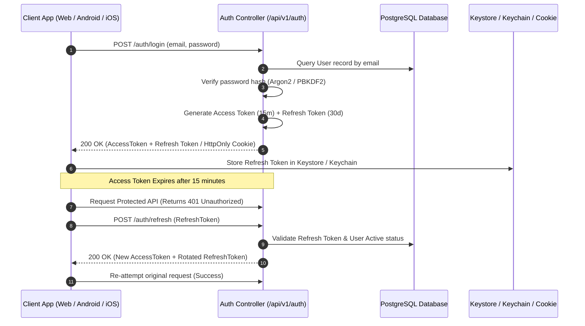

#### Workflow Steps:
1. **Registration / Login**: User enters email and password. Password is validated and compared against stored Argon2/PBKDF2 hashes.
2. **Token Generation**: On successful authentication, backend generates a short-lived **Access Token** (15 minutes) and a long-lived **Refresh Token** (30 days).
3. **Platform Secure Storage**:
   - **Android / iOS**: Refresh token is saved to Android Keystore / iOS Keychain via Capacitor secure bridge.
   - **Web**: Refresh token is stored in a secure, `HttpOnly`, `SameSite=Strict` cookie.
4. **Role-Based Access Control (RBAC)**: Middleware inspects the token payload for user role (`user`, `advisor`, `manager`, `admin`) and enforces access policies.
5. **Silent 401 Refresh**: When an access token expires, client Axios interceptor catches the 401, invokes `/auth/refresh` once (`_retry = true`), updates the token, and replays the original request. If refresh fails, it initiates clean logout.
6. **Multi-User Logout Isolation**: Logout purges all local IndexedDB tables (`accounts`, `transactions`, `loans`, `goals`, `investments`, `recurringTransactions`, `budgets`, `gold`, `notifications`), ensuring zero data leakage between users on shared devices.

---

### Feature 2: Multi-Account Ledger & Real-Time Balance Aggregation

```mermaid
flowchart TD
    A[User Creates Account: e.g. HDFC Bank, Cash, Credit Card] --> B[Generate clientRequestId & Initial Balance in Paise]
    B --> C[POST /api/v1/accounts with Idempotency-Key]
    C --> D{DB Invariant Check: @@unique([userId, clientRequestId])}
    D -- New Account --> E[Create Account in PostgreSQL with openingBalance & balance]
    D -- Duplicate Replay --> F[Return Existing Account Record (Idempotent)]
    E --> G[Persist in Dexie Local DB]
    G --> H[Recalculate Net Worth & Total Liquid Assets]
    H --> I[Update Dashboard Visual Balance Cards]
```

#### Workflow Steps:
1. **Account Setup**: User specifies account name, type (`bank`, `cash`, `credit_card`, `wallet`, `investment`), currency (`INR`), and opening balance.
2. **Idempotency Guard**: Client generates a `clientRequestId` and sends `POST /accounts`. PostgreSQL enforces `@@unique([userId, clientRequestId])`.
3. **Double-Entry Balance Formula**:
   $$\text{Current Balance} = \text{Opening Balance} + \sum(\text{Income}) - \sum(\text{Expenses}) + \sum(\text{Transfers In}) - \sum(\text{Transfers Out})$$
4. **Minor-Unit Integrity**: Stored and calculated as `BigInt` Paise to prevent floating-point inaccuracies.
5. **Real-Time Client Balance Sync**: Local Dexie database updates reactively to refresh total liquid cash and liabilities across all dashboard screens.

---

### Feature 3: Transaction Lifecycle & Double-Entry Ledger Engine

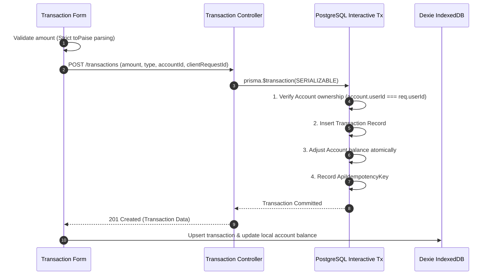

#### Workflow Steps:
1. **Input & Validation**: User specifies Amount, Category, Type (`income`, `expense`, `transfer`), Date, Account, and optional notes/receipt image.
2. **Lossless Conversion**: `financialMath.ts` parses the numeric input string into integer Paise.
3. **Atomic Transaction Boundary**:
   - Backend opens `prisma.$transaction`.
   - Verifies account ownership: `account.userId === req.userId`.
   - In transfer transactions, verifies destination account ownership and updates both source and target balances simultaneously.
4. **Idempotency Guard**: Repeated submissions with the same `clientRequestId` return the existing transaction record without duplicate debit or credit.
5. **Analytics Trigger**: Updates monthly spending summaries, category pie charts, and budget threshold calculations.

---

### Feature 4: Recurring Transactions & Automated SIP Engine

```mermaid
flowchart TD
    A[User Defines SIP / Recurring Rule: Frequency, NextDueDate, Amount] --> B[Save Rule with @@unique([userId, clientRequestId])]
    B --> C[PostgreSQL RecurringTransaction Table]
    
    subgraph Background Worker Execution (Cron)
        D[Worker Wakes Up every Minute] --> E[Find Pending Rules: nextDueDate <= NOW() & status = 'active']
        E --> F[Atomic DB Lock: RecurringExecution @@unique([ruleId, scheduledDate])]
        F -- Lock Acquired --> G[Create Real Transaction in Ledger]
        G --> H[Update Account Balance Atomically]
        H --> I[Advance nextDueDate: daily/weekly/monthly/yearly]
        F -- Already Claimed --> J[Skip (Zero Duplicate Execution)]
    end
```

#### Workflow Steps:
1. **Rule Setup**: User defines recurring schedule (Interval: `daily`, `weekly`, `monthly`, `quarterly`, `yearly`, Next Due Date, Amount, Category, and Account).
2. **Rule Invariant**: Saved with `@@unique([userId, clientRequestId])`.
3. **Background Worker Execution**:
   - Worker queries active rules where `nextDueDate <= NOW()`.
   - Attempts insert into `RecurringExecution` with constraint `@@unique([ruleId, scheduledDate])`.
   - The winning worker process executes the ledger transaction, updates the account balance, advances `nextDueDate`, and enqueues a completion notification.
   - Concurrent worker threads encountering duplicate keys skip gracefully with zero duplicate postings.

---

### Feature 5: Budgets & Proactive Threshold Alert System

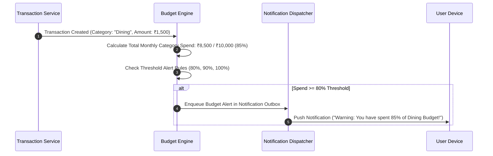

#### Workflow Steps:
1. **Budget Creation**: User sets monthly/weekly spending limits per category.
2. **Real-time Aggregation**: On every recorded transaction, total period spending for the category is recalculated.
3. **Threshold Engine**:
   $$\text{Spend Percentage} = \left(\frac{\text{Current Period Spend}}{\text{Budget Limit}}\right) \times 100$$
4. **Alert Dispatch**: Crossing 80%, 90%, or 100% threshold creates an outbox notification delivered via Push (FCM/APNs) and in-app alert banner.
5. **Dashboard Visuals**: Renders color-coded progress bars (Green < 70%, Yellow 70–90%, Red > 90%).

---

### Feature 6: Loans, Debts & EMI Amortization Tracking

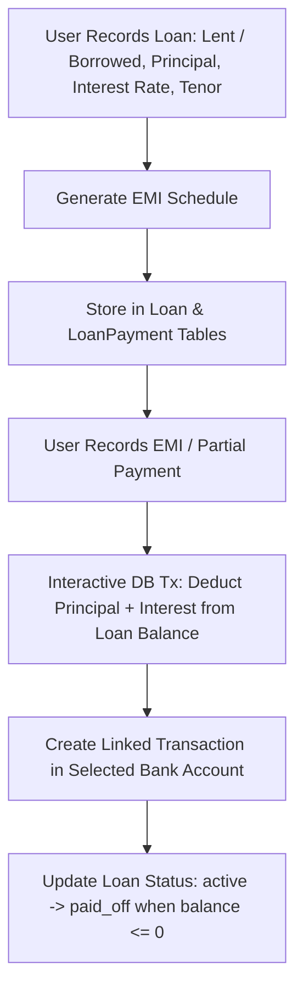

#### Workflow Steps:
1. **Loan Creation**: Logs loans (`lent` to an individual or `borrowed` from a financial institution) with Principal, Interest Rate, Tenor, and Start Date.
2. **Amortization Engine**:
   $$\text{EMI} = \frac{P \times r \times (1 + r)^n}{(1 + r)^n - 1}$$
3. **Repayment Logging**: User logs monthly EMI or partial repayment; interactive transaction deducts from outstanding loan balance and records a ledger transaction in the linked bank account.
4. **Automatic Closure**: Transition to `paid_off` occurs automatically when the balance reaches zero.

---

### Feature 7: Savings Goals & Milestone Progress Engine

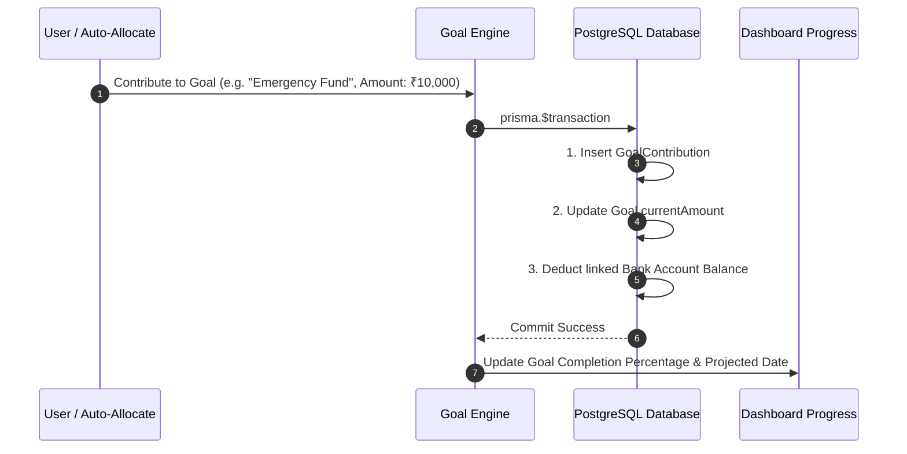

#### Workflow Steps:
1. **Goal Configuration**: User creates a target milestone with Target Amount, Target Date, and Category.
2. **Contributions**: Manual deposits or automated allocations record linked transactions in bank accounts and update `Goal.currentAmount`.
3. **Metrics Calculation**: Computes percentage completed and required monthly savings to meet the target on schedule.
4. **Visual Milestones**: Renders interactive progress rings and celebratory milestone badges.

---

### Feature 8: Investment Portfolio & Real-Time Net Worth Valuation

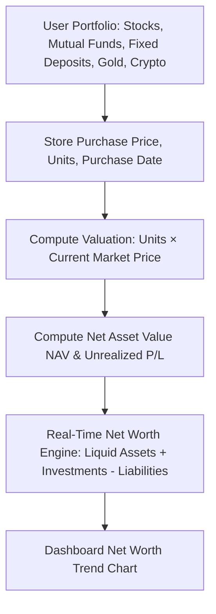

#### Workflow Steps:
1. **Portfolio Tracking**: Logs holdings across Stocks, Mutual Funds, Fixed Deposits, Gold, and Crypto.
2. **Live Valuation**: Multiplies held units by live/cached market rates to determine current asset value.
3. **P&L Metrics**:
   $$\text{Unrealized P/L} = \text{Current Value} - \text{Total Invested}$$
4. **Net Worth Synthesis**: Aggregates all bank balances, investments, gold holdings, and lent loans minus borrowed debts.

---

### Feature 9: Gold Asset Tracking (Physical, Digital & SGBs)

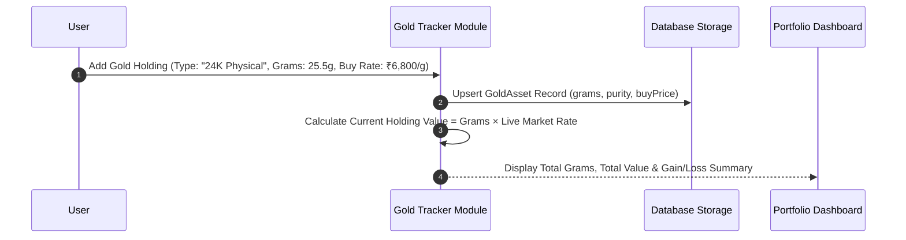

#### Workflow Steps:
1. **Asset Entry**: Tracks 24K/22K Physical Gold (jewelry, coins, bars), Digital Gold, and Sovereign Gold Bonds (SGB).
2. **Valuation Engine**: Automatically converts total gram holdings to live INR portfolio valuation and incorporates it into the user's Net Worth calculation.

---

### Feature 10: Group Expense Splitting & Debt Simplification

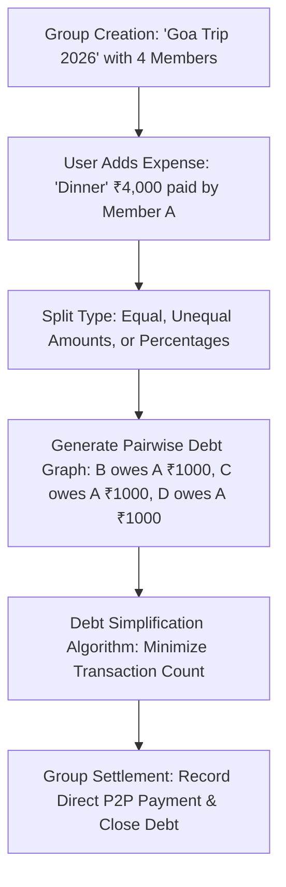

#### Workflow Steps:
1. **Group Setup**: Users create a shared group and add members.
2. **Expense Splitting**: An expense is recorded with Equal, Unequal, or Percentage splits.
3. **Debt Simplification Algorithm**:
   - Calculates net balances: $\text{Net Balance}_i = \text{Paid}_i - \text{Owed}_i$.
   - Bipartite graph reduction matches highest debtors with highest creditors, minimizing total settlement transfers.
4. **Settlement**: Members log settlements to clear balances.

---

### Feature 11: Smart OCR Receipt & Bill Scanner

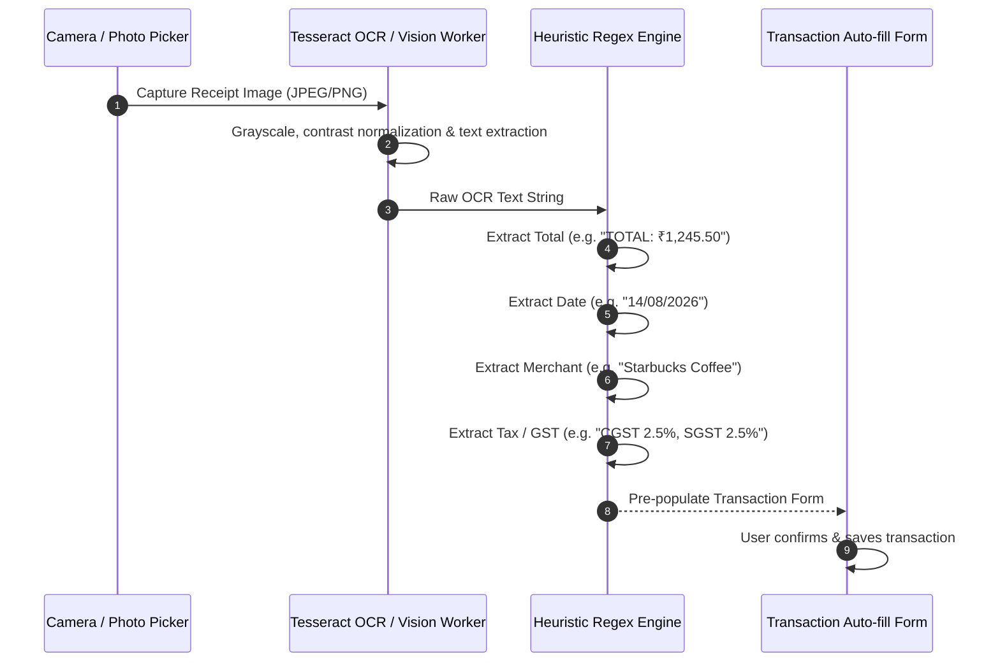

#### Workflow Steps:
1. **Image Capture**: User photographs a physical bill or uploads an invoice.
2. **Pre-processing & OCR**: Image is normalized and parsed by Tesseract.js worker.
3. **Heuristic Extraction**: Parses total amount, transaction date, merchant name, and tax breakdown.
4. **Form Auto-fill**: Pre-populates the transaction modal for instant user confirmation.

---

### Feature 12: Voice-Assisted Speech-to-Transaction Entry

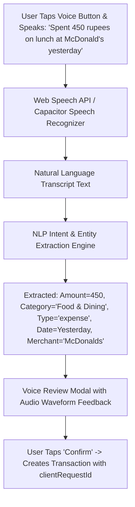

#### Workflow Steps:
1. **Audio Input**: User speaks a transaction phrase into the microphone.
2. **NLP Entity Parser**: Extracts Amount, Category, Type, Merchant, and relative Date ("today", "yesterday").
3. **Review & Confirm**: Displays extracted fields in a confirmation dialog before committing to the database.

---

### Feature 13: Financial Advisor Marketplace & Session Bookings

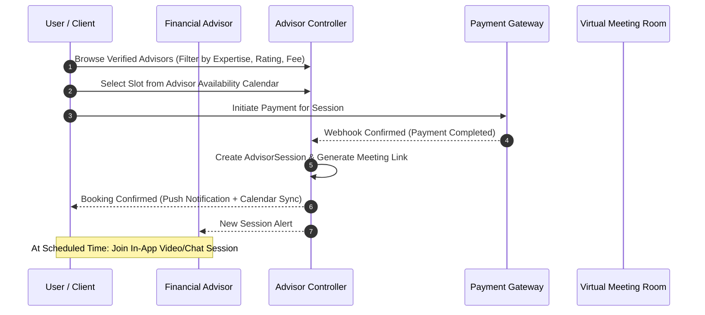

#### Workflow Steps:
1. **Advisor Verification**: Advisors submit credentials and hourly consultation rates for admin approval.
2. **Slot Selection**: Clients browse verified advisors and select available calendar slots.
3. **Secure Checkout**: Payment gateway locks the slot and generates an encrypted virtual meeting session on payment confirmation.

---

### Feature 14: Payment Processing, Webhook Invariants & Refund State Machine

```mermaid
flowchart TD
    A[Payment Initiation: Amount, Currency, Purpose, ClientRequestId] --> B[Create Payment with status='pending' & unique transactionId]
    B --> C[Payment Provider Gateway Razorpay / Stripe]
    C --> D[Provider Webhook / Callback Arrives]
    D --> E{Backend Verification & Atomic Transaction}
    E -- Success Webhook --> F[Transition: pending -> completed]
    F --> G[Credit Advisor / Record System Ledger]
    E -- Refund Request --> H[Check: Current status == 'completed']
    H -- Valid --> I[Interactive Tx: Transition completed -> refunded]
    I --> J[Return Refund Confirmation (100-Concurrent Safe)]
    H -- Invalid Replay --> K[409 Conflict / Idempotent Reject]
```

#### Workflow Steps:
1. **Initiation**: Creates `Payment` with status `pending` and `@unique transactionId`.
2. **Webhook Verification**: Validates provider signature and executes state transition (`pending` $\rightarrow$ `completed`) in an interactive transaction.
3. **Refund State Machine**: Transitions `completed` $\rightarrow$ `refunded`. Illegal transitions are rejected.
4. **Concurrency Safety**: 100 concurrent refund requests result in **exactly 1 refund execution**.

---

### Feature 15: Multi-Channel Notification & Outbox Dispatcher

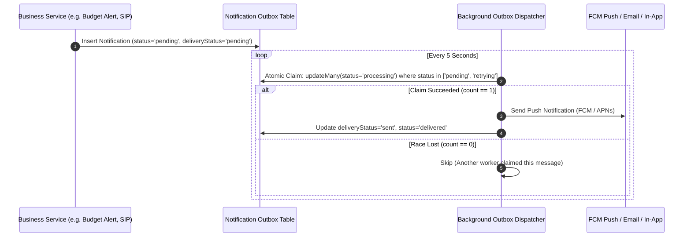

#### Workflow Steps:
1. **Event Trigger**: Business events write notification records with `status: 'pending'`.
2. **Atomic Worker Claim**: Conditional `prisma.notification.updateMany` transitions status to `processing`, preventing multi-worker duplicate delivery races.
3. **Dispatch**: Delivers push notifications to FCM/APNs device tokens and updates in-app notification state.

---

### Feature 16: Offline-First Synchronization & Deterministic Reconciliation Engine

```mermaid
flowchart TD
    A[Mobile Client Creates Transaction while Offline] --> B[Store in Dexie IndexedDB with clientRequestId='req-uuid-1']
    B --> C[Enqueue in db.syncQueue with status='pending']
    C --> D[Device Reconnects to Internet: window.online event]
    D --> E[BackendSyncService.syncWithBackend()]
    E --> F[POST /sync/pull: Retrieve Server State since lastSyncTime]
    F --> G[Deterministic Reconciliation: Match by cloudId or clientRequestId]
    G --> H[Update Local Records by Stable Key - NO DUPLICATION on repeated pull]
    H --> I[Push Pending syncQueue items with Idempotency-Key]
    I --> J[Mark syncQueue item as 'synced' & clear queue]
```

#### Workflow Steps:
1. **Local-First Writes**: Mutations write immediately to IndexedDB and enqueue in `db.syncQueue` with a stable `clientRequestId`.
2. **Network Reconnection**: Pulls cloud modifications since `lastSyncTime` and reconciles records strictly by `cloudId` or `clientRequestId`.
3. **Idempotent Push**: Pushes pending queue items with `Idempotency-Key`.
4. **Zero Duplication**: Pull-to-refresh (1x, 2x, 5x) updates by stable ID without appending duplicate records.

---

### Feature 17: Platform Security, Governance & Distributed Rate Limiting

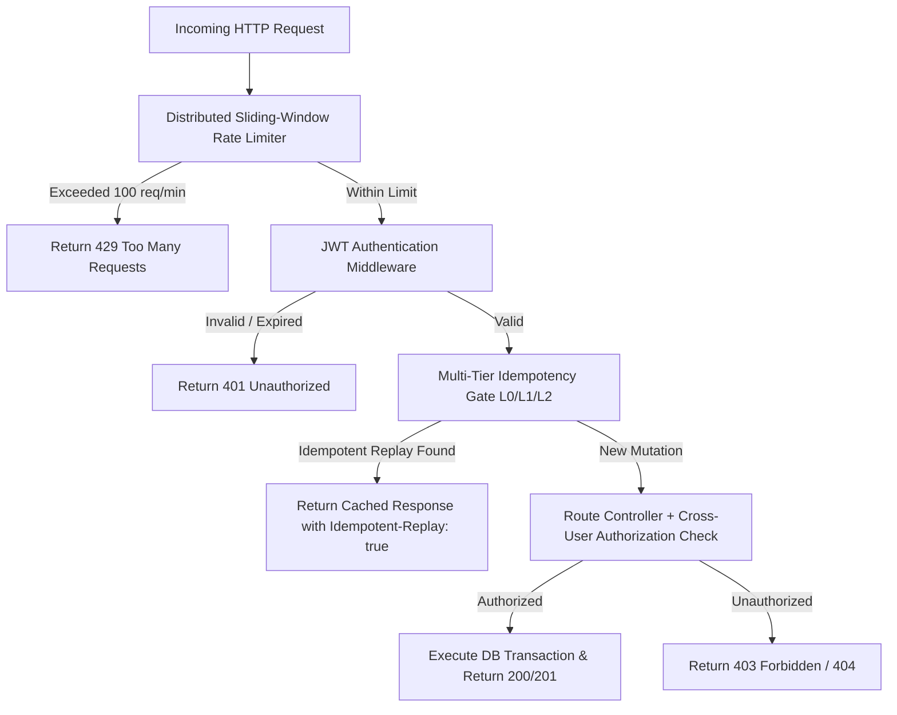

#### Workflow Steps:
1. **Rate Limiting**: Sliding-window rate limiter throttles traffic using Redis with local memory fallback.
2. **Multi-Tier Idempotency (L0/L1/L2)**: Protects against network replays and concurrent submissions across in-memory mutex, Redis cache, and PostgreSQL table.
3. **Cross-User Authorization**: Strict controller-level checks (`resource.userId === req.userId`) protect all user resources.
4. **Zero-Secrets Policy**: Scanned across 8,537 files ensuring zero credentials or private keys in client bundles.
