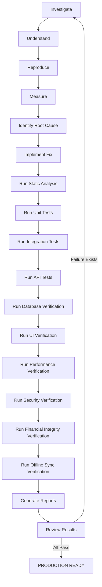

# KANAKKU EXECUTION CONTRACT

You are responsible for stabilizing the Kanakku application.

You are NOT responsible for simply implementing code.

You are responsible for producing a production-ready application backed by measurable evidence.

## Execution Rules

1. Never assume.
2. Never guess.
3. Never skip verification.
4. Never mark a task complete because code compiles.
5. Never stop because one bug is fixed.
6. Always verify every fix.
7. Always generate evidence.
8. Always run regression tests.
9. Always document findings.

If any verification fails, return to investigation immediately.

---

## Execution Loop

Never exit the loop until every release gate passes.

---

## Evidence Required

Every verification must include evidence. Claims without evidence are considered unverified.

**Accepted evidence:**
- ✓ Test output logs
- ✓ Screenshots
- ✓ SQL query results
- ✓ API responses
- ✓ Log outputs
- ✓ Performance graphs
- ✓ Browser recordings
- ✓ Database snapshots
- ✓ Before / After comparisons
- ✓ Execution times

---

## Severity Classification

- **Critical:** Data loss, Financial inconsistency, Security vulnerability, Authentication failure, Database corruption.
- **High:** Failed CRUD, API failures, Performance above SLA, Broken synchronization.
- **Medium:** UI inconsistencies, Slow rendering, Minor functional defects.
- **Low:** Cosmetic issues, Minor UX improvements.
- **Informational:** Suggestions, Refactoring, Code cleanup.

---

## Acceptance Criteria

A task is COMPLETE only if:
- [ ] Root Cause Identified
- [ ] Fix Implemented
- [ ] Unit Tests Pass
- [ ] Integration Tests Pass
- [ ] API Tests Pass
- [ ] Database Verified
- [ ] UI Verified
- [ ] Performance Meets SLA
- [ ] Security Verified
- [ ] Financial Integrity Verified
- [ ] No Regression
- [ ] Documentation Updated
- [ ] Evidence Attached

---

## Final Release Decision

The AI is forbidden from outputting `"Done"`, `"Completed"`, or `"Fixed"` until ALL acceptance criteria are satisfied.

Instead, output **IN PROGRESS** or **BLOCKED** with evidence explaining why.

Only when every release gate passes may the AI output:

> **KANAKKU STATUS**  
> **PRODUCTION READY**  
> **Overall Readiness:** XX%  
> **Evidence Location:**  
> - `READINESS_REPORT.md`  
> - `PERFORMANCE_REPORT.md`  
> - `SECURITY_REPORT.md`  
> - `DATABASE_INTEGRITY_REPORT.md`  
> - `FINANCIAL_INTEGRITY_REPORT.md`  
> - `CONCURRENCY_REPORT.md`  

---

# Verification Plan Detail

## 1. Safety Guardrails & Environment Protection

- **Environment Detection:** Every test and stress script will query the database metadata and target URLs before running.
- **Safety Gate:** If a production environment is detected, all write, load, security-injection, and concurrency stress tests will immediately abort. Only safe, read-only validation is permitted on production endpoints.
- **Dedicated Staging Database:** High-volume concurrency, stress, and destructive rollback tests will run exclusively on a cloned local PostgreSQL staging database (`localhost:5432` or `5433` using the staging schema).

---

## 2. API Contract & Robustness Testing

- **Schema Compliance:** Request/Response validation matching OpenAPI specs.
- **Input Boundaries:** Rejection of negative amounts, null values, over-sized payloads, and invalid email formats.
- **Idempotency & Resilience:** Verification of duplicate prevention via idempotency keys on bulk writes, timeout responses, and retry behavior.

---

## 3. Database Consistency & Ledger Integrity

- **Double-Entry Balance Checks:** Verifying that account balances exactly match the sum of their transactions (Opening Balance + SUM(ledger entries)) under normal and concurrent use.
- **ACID Rollback:** Forcing transaction errors and verifying complete rollbacks of balance modifications.
- **Constraint Safety:** Testing index violations, foreign key deletions, and ensuring no orphan records or balance drifts occur.

---

## 4. Frontend Performance & Core Web Vitals

- **Web Vitals:** Benchmark TTFB, FCP, LCP, and TTI.
- **Bundle & Memory Audit:** Profile compiled JS chunk sizes, memory retention, and search for socket/SSE connection leaks.

---

## 5. Real User Journey Simulations

We will simulate four complete, multi-step user scenarios using automation scripts:
- **Journey 1: CRUD:** Register & Login → Create Account → Create/Edit/Delete Expense → Session Cycle & Verify Persistence.
- **Journey 2: Loans:** Create EMI Loan → Record Payments → Verify Balance → Generate & Verify Reports.
- **Journey 3: Offline:** Go Offline → Create Offline Expense → Go Online → Verify Queue Sync & Dashboard.
- **Journey 4: Groups:** Create Group → Invite & Split Bill → Settle & Notify → Verify Ledger & DB Integrity.

---

## 6. Long-Running Endurance & Failover Recovery

- **Endurance Run:** Execute background stability script simulating active sync intervals over a prolonged period to monitor heap memory growth, unhandled promise rejections, and connection pool exhaustion.
- **Failover Verification:** Simulate network timeouts, database restarts, and token expirations to confirm the client recovers gracefully without UI locks.
- **Disaster Recovery Strategy:** Verify DB schema rollback scripts, backup dumps, and point-in-time recovery workflows.

---

## 7. Deployment & Readiness Checks

- **Build Completeness:** Successful compiling of development, production, and Docker bundles.
- **Infrastructure Checklist:** Verify SSL configuration, CDN caching rules, environment secrets isolation, and active readiness/liveness health endpoints.

---

## 8. Production Release Gate

The application MUST NOT be marked as production-ready until every release gate below has passed.

### A. FEATURE COMPLETENESS
- [ ] Every planned feature works.
- [ ] Every CRUD operation succeeds.
- [ ] Every financial calculation is correct.
- [ ] Every report matches database values.
- [ ] Every user role behaves correctly.
- [ ] Every permission is enforced.

### B. OBSERVABILITY
- [ ] Structured logs.
- [ ] Request tracing & correlation IDs.
- [ ] Error tracking.
- [ ] Health endpoints.
- [ ] Metrics endpoint.
- [ ] Slow query logging.
- [ ] API latency dashboard.
- [ ] Crash reporting & alerting configured.

### C. DATABASE MIGRATION VALIDATION
- [ ] All Prisma migrations succeed.
- [ ] Migration rollback succeeds.
- [ ] No data loss or schema drift.
- [ ] Foreign keys preserved, indexes created, constraints verified.
- [ ] Existing production data remains valid.

### D. BACKUP VALIDATION
- [ ] Full backup created.
- [ ] Restore tested.
- [ ] Point-in-time recovery tested.
- [ ] Disaster recovery documented.

### E. SECURITY CHECKLIST
- [ ] OWASP Top 10 validation.
- [ ] Dependency vulnerabilities scanning.
- [ ] Secret scanning.
- [ ] JWT validation & RBAC verification.
- [ ] Rate limiting, HTTPS, CSP, and CORS validation.
- [ ] Cookie & Session security.

### F. PERFORMANCE GATES
The application must satisfy:
- Login < 2 sec
- Dashboard < 1 sec
- CRUD < 500 ms
- Search < 300 ms
- API Error Rate < 0.5%
- P95 API Latency < 800 ms
- P99 API Latency < 1500 ms
- Database Query < 100 ms average

### G. CODE QUALITY
- [ ] No TODOs or FIXMEs.
- [ ] No console.log in production.
- [ ] No commented dead code or duplicate code.
- [ ] No lint errors, TypeScript errors, or build warnings.

### H. DEPLOYMENT VALIDATION
- [ ] Development build, Production build, and Docker build succeed.
- [ ] CI/CD pipeline, environment variables, and secrets verified.
- [ ] SSL, compression, health checks, readiness checks, and monitoring verified.

### I. POST-DEPLOYMENT VALIDATION
After deployment, run smoke tests and verify:
- Login, Dashboard, Transactions, Reports, Notifications.
- Realtime sync, database writes/reads, and rollback strategy.

### J. RELEASE SCORE
We will calculate scores (0-100%) for:
- Reliability Score
- Security Score
- Performance Score
- Maintainability Score
- Code Quality Score
- Database Score
- Infrastructure Score
- Deployment Score
- Overall Production Readiness Score
- Overall Risk Score

The application can only be marked **"PRODUCTION READY"** when **Reliability, Security, Performance, and Overall Readiness are all ≥ 95%**, with **zero** critical issues, high-severity issues, data loss, security vulnerabilities, financial calculation errors, database corruption, or regression failures.

---

## 10. Required Release Deliverables

We will automatically generate the following release artifacts under `<appDataDir>\brain\<conversation-id>\release\`:
1. `READINESS_REPORT.md` — Executive summary and deployment recommendation.
2. `PERFORMANCE_REPORT.md` — API latency, frontend metrics, database query timings, Core Web Vitals.
3. `SECURITY_REPORT.md` — Vulnerabilities found, fixes applied, remaining risks.
4. `DATABASE_INTEGRITY_REPORT.md` — Ledger consistency, balances, transaction validation, rollback tests.
5. `FINANCIAL_INTEGRITY_REPORT.md` — Opening/closing balances, transfers, EMIs, savings goals, investments, reconciliation.
6. `CONCURRENCY_REPORT.md` — Results of simultaneous operations, locking behavior, duplicate prevention.
7. `KNOWN_ISSUES.md` — Any remaining issues with severity, impact, and suggested fixes.
8. `DEPLOYMENT_CHECKLIST.md` — Environment variables, migrations, backups, rollback plan, monitoring.
9. `DATA_INTEGRITY_AUDIT.md` — Audit verification details for orphan records, constraints, and balance reconciliation.
10. `OFFLINE_SYNC_REPORT.md` — Results and timings of offline CRUD, reconnect, and conflict resolution flows.
11. `OBSERVABILITY_REPORT.md` — Active validation of performance/system dashboards and slow query alerts.
12. `CODE_REVIEW_REPORT.md` — SOLID, DRY, and clean-code anti-pattern audit logs.

---

## 11. Root Cause Analysis (Mandatory)

Every failed test must generate a detailed Root Cause Analysis (RCA) *before* any code changes are introduced.

The RCA must be logged in the active workspace and contain:
- **Test ID** & **Feature Name**
- **Execution Environment**
- **Reproduction Steps**
- **Expected Result** vs **Actual Result**
- **Error Logs** & **Stack Trace**
- **Associated API Requests** & **Database Queries**
- **Failure Timeline**
- **Root Cause Identification**
- **Impact Assessment**
- **Proposed Solution** & **Regression Risk**
- **Preventive Actions**

---

## 12. Continuous Regression Gate

After any successful code change, the relevant test runners will be triggered automatically to detect regressions:
- Determine affected modules and run Unit, Integration, API, DB, UI, Performance, and Security tests.
- **Immediate Halt on Regression:** If any regression is identified, execution stops instantly, a regression report is generated, and control returns to: Investigate → Fix → Retest.

---

## 13. Engineering Decision Log

All structural, architectural, or behavioral changes must be recorded in an engineering decisions log stored at the workspace root as `ENGINEERING_DECISIONS.md`, detailing:
- **Date** & **Files Modified**
- **Reason for Change**
- **Alternative Approaches Considered**
- **Chosen Solution** & **Trade-offs**
- **Performance, Security, and Database Impacts**
- **Future Improvements**

---

## 14. Data Integrity Audit

Every financial table will be audited automatically before every release to guarantee schema and logical consistency:
- **Zero Orphan Records:** All transactions and items correspond to valid parents.
- **Zero Duplicate Entries:** Check for duplicate transactions, accounts, categories, and sync records.
- **Reconciliation Check:** Account balance must exactly equal its ledger balance total.
- **Debit/Credit Check:** Verify double-entry balances for transfers.
- Logs will be compiled into `DATA_INTEGRITY_AUDIT.md`.

---

## 15. Offline Synchronization Validation

We will automatically test the offline sync runner under simulated offline-online toggles:
- **Offline CRUD Cycle:** Create → Update → Delete operations enqueued while offline.
- **Conflict Handling:** Conflict detection, retry queues, reconnect triggers, and database replication sync check.
- Metrics (queue sizes, retry timings, conflict counts) will be compiled into `OFFLINE_SYNC_REPORT.md`.

---

## 16. Production Observability

Confirm dashboards and monitors are fully provisioned to track metrics continuously:
- Query response times, API error rates, database locking metrics, slow query alerting thresholds.
- WebSocket liveness status, CPU/Memory footprint metrics.
- Findings will be compiled into `OBSERVABILITY_REPORT.md`.

---

## 17. AI Code Review

Every modified codebase file will be audited for best practice standards:
- **Quality Gates:** SOLID principles, DRY, KISS, SoC (Separation of Concerns).
- **Anti-pattern Check:** Dead code, performance bottlenecks, race conditions, react re-render optimization, memory leak indicators.
- Metrics and issues logged in `CODE_REVIEW_REPORT.md`.

---

## 18. Executive Release Decision

The release cycle will culminate in a final summary score card:
- **Ready/Not-Ready Recommendation:** Deployment recommendations based on release scores.
- Deployment is strictly blocked if any mandatory release gate fails.
