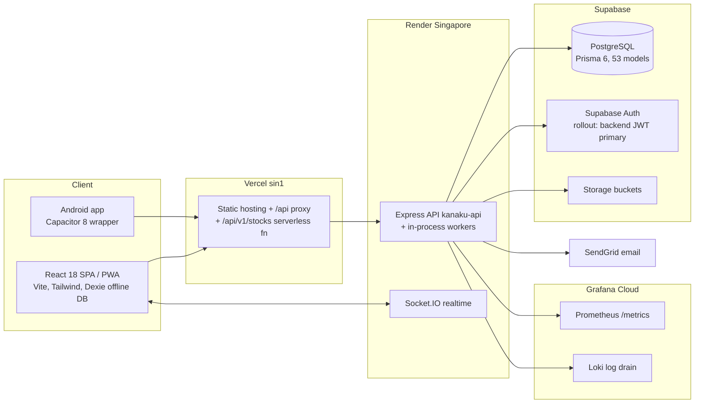

# Kanaku — System Architecture (Beta Audit Snapshot, 2026-07-19)

> Verified against the live codebase during the Beta Release Readiness audit.
> Deep-dive canonical references: [architecture/OVERVIEW.md](../architecture/OVERVIEW.md),
> [02_TRD.md](../02_TRD.md), [04_APP_FLOW.md](../04_APP_FLOW.md), ADRs in [docs/architecture/](../architecture/).

## Topology

## Components (verified)

| Component | Tech | Location | Notes |
|---|---|---|---|
| Frontend SPA | React 18, Vite, TypeScript, Tailwind, Dexie (IndexedDB) | `frontend/` | Offline-first; state-machine page router in `app/App.tsx` (~45 lazy-loaded pages); admin UI compiled out of user builds via `__ADMIN_UI_ENABLED__` |
| Backend API | Express + TypeScript, Prisma 6.19 | `backend/src` | 37 feature modules, 265 routes under `/api/v1`; feature-folder architecture (routes → controller → service → repository) |
| Background workers | node-cron in-process or separate `worker.ts` | `backend/src/workers` | Notification outbox drainer, recurring transactions, cleanup; `RUN_WORKERS_IN_API` switches combined/split mode |
| Realtime | Socket.IO | `backend/src/sockets` | Group/notification push to clients |
| Database | Supabase PostgreSQL (pgbouncer :6543 pooled, :5432 direct) | `backend/prisma/schema.prisma` | 53 models; soft deletes; event store + snapshots |
| Auth | Backend-issued JWT (primary) + Supabase JWT (rollout fallback, `ACCEPT_SUPABASE_JWT`) | `backend/src/middleware/auth.ts` | Role always re-read from DB, never trusted from client claims |
| Email | SendGrid + outbox pattern | `backend/src/workers/index.ts` | Retry with backoff, dead-letter at MAX_ATTEMPTS |
| Cache | Redis (optional) via `cache/redis.ts` | user-scoped response cache | TTL 30–180 s; per-user keys prevent cross-tenant leakage |
| Metrics/Logs | Prometheus registry + Grafana Loki drain, Sentry-style error tracker | `backend/src/config/metrics.ts`, `middleware/renderDrain.ts` | `/metrics` guarded by `METRICS_TOKEN` bearer |

## Request lifecycle (API)

`request-id/correlation-id stamping → AsyncLocalStorage request context → performance tracker →
timeout guard → metrics → HTTP logger → helmet (nonce CSP, HSTS) → CORS allowlist →
JSON body (1 MB, raw-body capture for webhook HMAC) → global sanitizer → rate limits
(global + per-scope) → route → authMiddleware → [pinGate] → [requireRole/requireFeature] →
zod validateBody/Params/Query → controller → service → repository (Prisma) → errorHandler`

## Module phasing

- Runtime feature flags: admin panel matrix via `requireFeature` (`middleware/featureGate.ts`), deny-by-default with audit events.
- Mount-level gating: Account Aggregator (`/aa`, Setu, Phase 5) is not mounted unless `ENABLED_MODULES=aa`.
- Ledger V2 double-entry: code-complete for groups; gated by `LEDGER_V2_ENABLED` (see [KNOWN_LIMITATIONS.md](KNOWN_LIMITATIONS.md) §1 — currently dark in all tracked configs).

## Scale posture

- Stateless API (JWT auth, no server session) → horizontally scalable behind a load balancer.
- Caveats for multi-instance: in-memory rate-limit counters, auth snapshot cache, and metrics
  registry are per-process; Redis-backed variants exist for cache but not for rate limiting.
  Documented in [PERFORMANCE_REPORT.md](PERFORMANCE_REPORT.md) §5.
